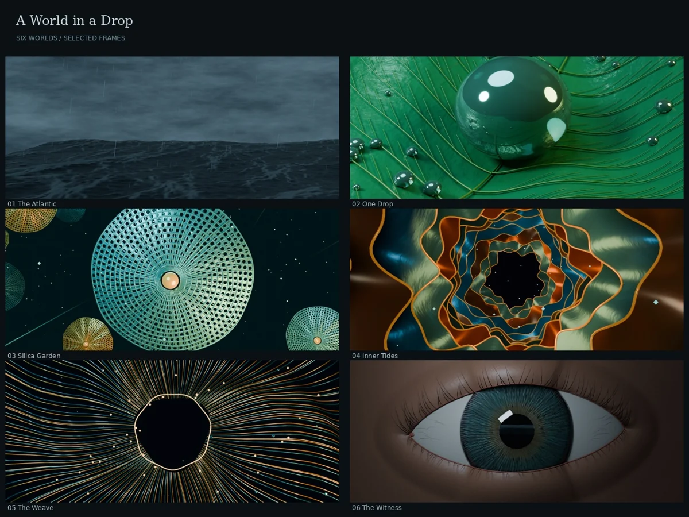
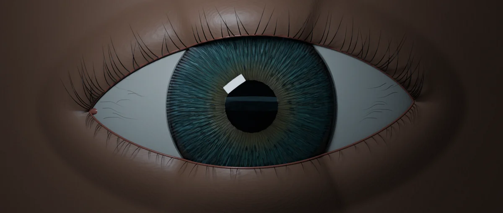

# A World in a Drop

A **62-second Blender film** travels from a stormy ocean to a raindrop on a leaf,
through porous silica forms, folded membranes and luminous filaments, then pulls
back to reveal an eye reflecting the opening sea. An original synthesized score
connects the six worlds.



| | |
| :-- | :-- |
| Model | GPT-6, Codex cloud session; exact model identifier and reasoning setting unrecorded |
| Human turns | 3: brief, eye revision, repository import |
| Brief | [Verbatim messages](brief.md) |
| Process | [Agent account](process/PROGRESS.md), [snapshots](process/snapshots/), [studies](process/studies/) |
| Production | 10 October 2026, approximately 12:28–17:44 UTC, including rendering and review |
| Full outputs | Declared for release `run-a-world-in-a-drop`; this import PR does not publish the release |

The human requested a more natural eye, longer lashes, and a better iris during
production. The finished revision uses overlapping almond-shaped lids, curved
tapered lashes, finer irregular iris fibres and crypts, and a transparent cornea
with a ray-traced reflection of the opening ocean.



## Reproduce

Use **Python 3.12**, the official **Blender 4.3.2** build with Cycles and
OpenImageDenoise, and **FFmpeg/ffprobe** with libx264, AAC, drawtext, xfade and
minterpolate. Production used FFmpeg 7.1.5. Python packages are pinned in
`requirements.txt`; the licensed DejaVu fonts are included.

From this run directory:

```bash
python3.12 -m venv .venv
. .venv/bin/activate
pip install -r requirements.txt
# Set BLENDER_BIN to your Blender executable if it is not on PATH.
python src/build.py --smoke
python src/build.py
python src/verify.py
```

[Official Blender 4.3.2 Linux download](https://download.blender.org/release/Blender4.3/blender-4.3.2-linux-x64.tar.xz).
Other platforms can use the [official download archive](https://www.blender.org/download/previous-versions/).
The official `bpy==4.3.0` module was also installed during production in a separate
Python 3.11 environment with `numpy<2`; the build above only needs Blender's
embedded bpy. No separate official product named “bpy CLI” is assumed.

`src/build.py` copies the renderer sources into `output/production/source/`,
where their original relative paths remain valid. It builds geometry, renders
the opening ocean, packs that image into the eye, renders the film and stills,
synthesizes sound, creates the native edit, assembles the movie, verifies it and
exports the six declared assets plus `SHA256SUMS` to `output/`. The smoke build
uses an independent `output/smoke/` tree, so its small images cannot contaminate
the final frame cache. It builds every scene and the native edit but renders
only seven 320 x 136 images: the ocean reflection and one frame per world.

Existing frame and still caches are resumable. A changed renderer source hash
stops the build: preserve or rename the corresponding work tree before starting
fresh. Likewise, use a fresh work tree when changing Blender or render settings.
Preserve downloaded original assets before a new full build, which replaces the
six top-level output files. No build deletes recovery copies.

The delivered film contains 792 Cycles renders at 12 rendered images per second,
reconstructed to 24 fps by FFmpeg motion compensation. Frames are 1280 x 544;
maximum samples are 12, or 24 for the revised eye, with adaptive sampling and
denoising. The six stills are independent 1920 x 816 renders at 64 maximum samples.
All scene animation is native 24 fps and can be rendered every frame at higher
quality. The editable scene-strip timeline uses native geometry; the canonical
MP4 additionally has FFmpeg's vignette and temporal reconstruction.

## How it is made

The ocean uses a spectral Ocean modifier, with procedural foam and rain. A
keyframed drop settles on a modeled leaf. Perforated radial meshes evoke diatoms;
animated folded surfaces and filament curves become progressively more abstract.
Matched circular compositions and 1.5-second dissolves preserve a visual thread.
The last iris contains approximately 930 fine curves and branched detail, a
polar procedural shader, and a curved transparent cornea. An off-camera card
carrying the first ocean frame creates the reflection.

The sound is original NumPy/SciPy synthesis: filtered noise for sea, rain and
thunder, with detuned partials and glass-like tones. No external stock imagery,
meshes, recordings, music, or image/video-generation models were used.

See [ART_AND_SCIENCE.txt](ART_AND_SCIENCE.txt) for the distinction between natural
inspiration and invention. This is a poetic journey, not scientific microscopy,
a continuous physical scale, or a validated fluid or eye-optics simulation.

## Process notes and limitations

- The eye remains stylized procedural anatomy. The feedback led to a substantial
  rebuild; no photorealistic or anatomically validated result is claimed.
- The earliest animatic preserves an older ocean and an unwanted camera roll.
  Later inspection caught face-mesh corners, an incorrect native-edit color
  transform and a corneal pole highlight. These were corrected before delivery.
- The original early eye frames and still were repaired with localized Blender
  renders composited over the pole defect. Current geometry includes the fix;
  fresh renders need no patch. Historical scripts and checkpoints remain in the
  original complete archive.
- Temporal interpolation and low-sample denoising can soften fine motion or
  detail. Rendering every source frame with more samples is supported by the
  renderer, but was not used for the delivered film.
- The original movie decoded fully: 1,488 frames, 62 seconds, Rec.709, stereo
  48 kHz. Its audio measured −18.02 LUFS, true peak −4.37 dBFS. Contact sheets,
  transitions and selected full-size frames were inspected; a continuous
  perceptual playback/listening review is not claimed.
- Import validation repeats asset hashes, complete movie decoding and still
  decoding, and executes a fresh geometry/small-render/native-edit smoke build.
  It does not claim a second full-resolution film render.

## Release and provenance

Use a **manual upload**, not the collection's 120-minute Run assets workflow.
The original CPU production took over five hours. The run-local command refuses
a full build on GitHub Actions to prevent an unsuitable dispatch. Its manifest
timeout describes a local rendering allowance, not a promise about runner speed.

The six original files and `SHA256SUMS` are preserved in ignored `output/`.
[Original checksums](process/ORIGINAL-SHA256SUMS) identify the actual delivered
assets. The original complete archive includes the rough animatic, eight native
checkpoints, two final projects, full source, score, stills and movie. A new
build produces a new complete archive of current outputs, explicitly labeled as
a rebuild; it cannot recreate the historical sequence of revisions.

After merge, when publication is authorized, upload all six declared assets and
`SHA256SUMS` to `run-a-world-in-a-drop`. Release notes should identify them as
original outputs from 10 October 2026, with the source commit, rather than a CI
rebuild. Fetch with `python3 scripts/fetch_assets.py a-world-in-a-drop` from the
repository root, then run the verifier. Keep the original delivery and recovery
copies until downloaded files have been verified. This PR neither publishes a
release nor removes the preserved working directory or delivery archive.

Repository adaptation is recorded in [process/IMPORT.md](process/IMPORT.md).
Third-party font notices are in [src/renderers/fonts/LICENSE.txt](src/renderers/fonts/LICENSE.txt).
The curator note is intentionally empty.
