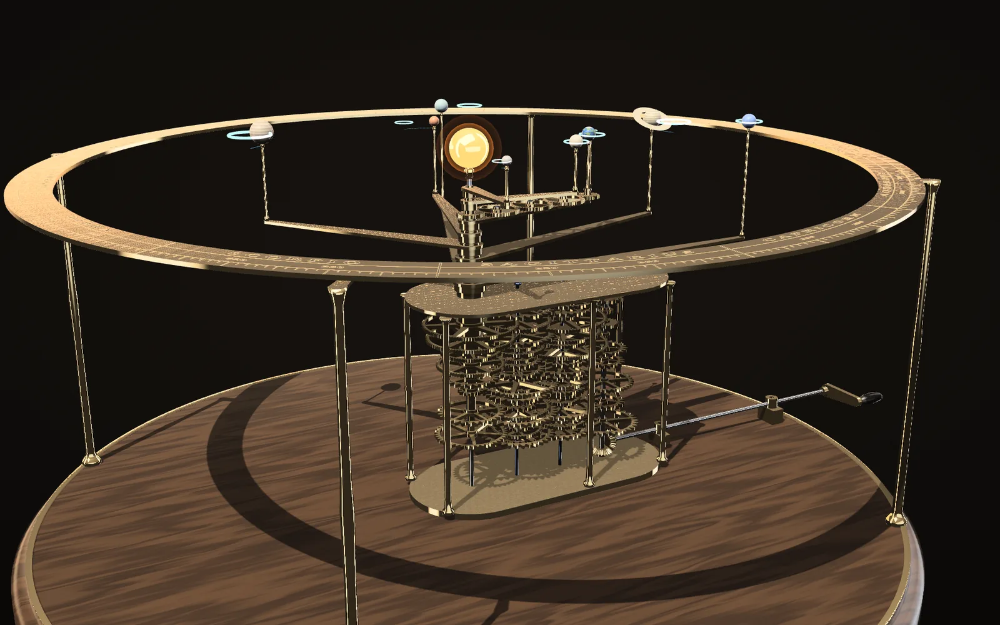
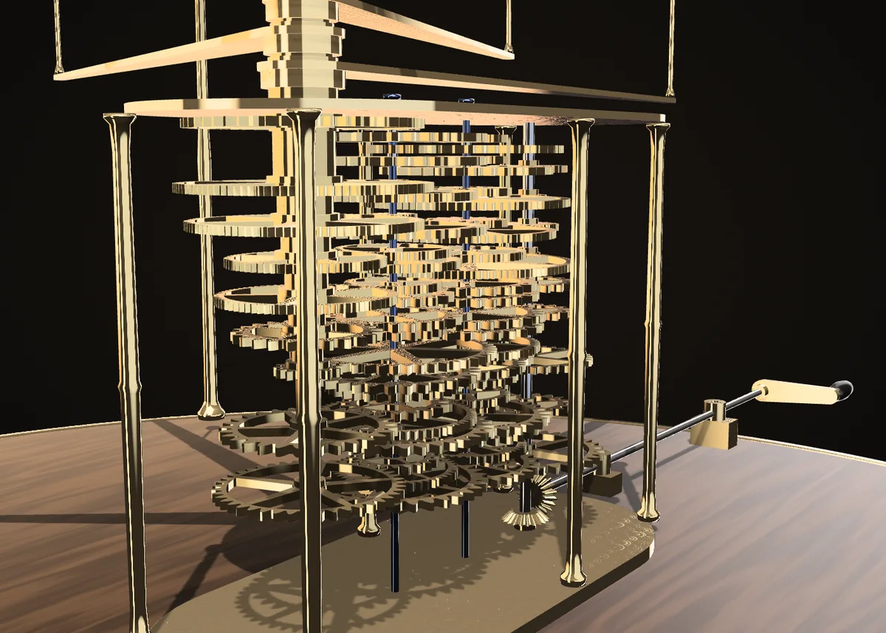
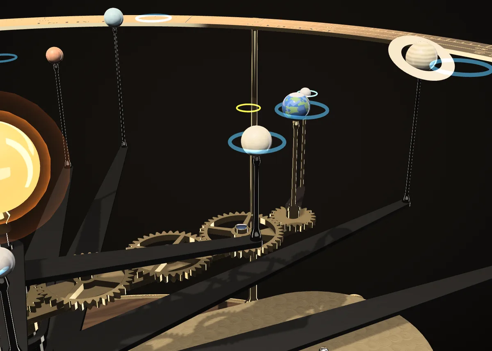
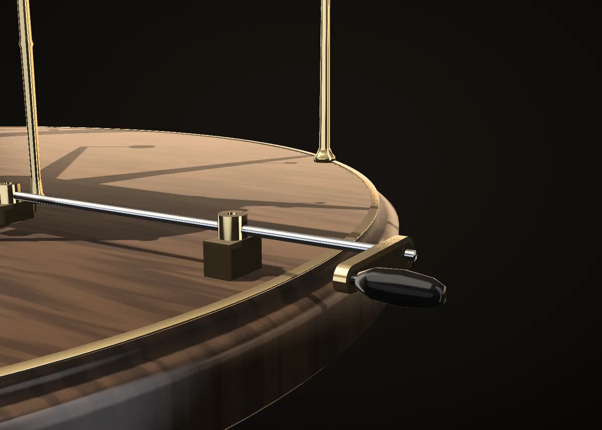
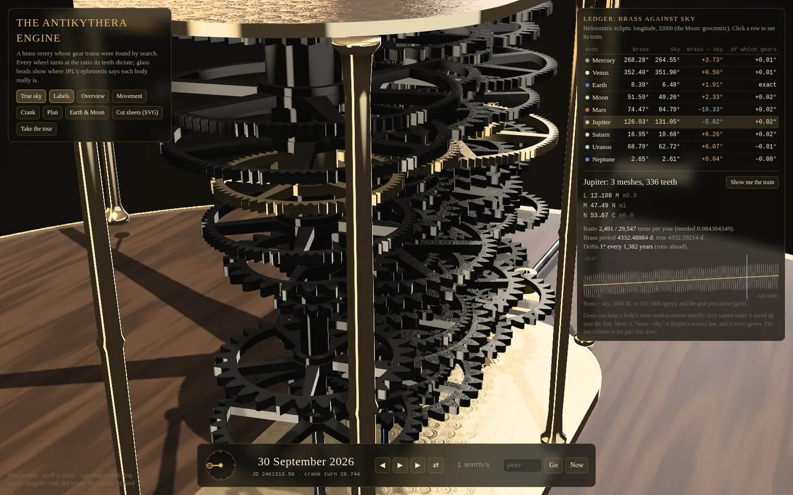

# The Antikythera Engine

A brass orrery in a web page whose gear trains were designed by search. Turn
the crank and seventy wheels carry the Sun's family round at exactly the
ratios their teeth dictate. Thin rings of light show where JPL's ephemeris puts
each body on the same date, so you can watch the brass and the sky disagree
and see why. Everything the brass claims can be checked: the ephemeris against
JPL Horizons, the ratios against exact arithmetic on the tooth counts, the
machine against a collision checker.



| | |
| :--- | :--- |
| **Open it** | [`index.html`](index.html): one file, no install, no server, WebGL 2 |
| **Model** | Claude Opus 5.5 (Claude Code, cloud session) |
| **Brief** | [`brief.md`](brief.md): a conversation, 2 human turns |
| **Wall clock** | about 2 h 10 min of active work: 18:55 to 20:05 UTC, and 01:05 to 02:00 after the container was reclaimed (most of the second stretch was the film render) |
| **Process** | [`process/PROGRESS.md`](process/PROGRESS.md), [snapshots](process/snapshots/) |

<p>
  
  
  
  
</p>

## Open it

`open index.html` (or double-click it). Drag to orbit, scroll to zoom,
right-drag or shift-drag to pan. Drag the round crank dial to turn the machine
by hand: one turn of the dial is one turn of the crank, one sidereal year.
**Take the tour** runs a captioned minute through the machine. Click a row of
the ledger, or a planet, to light its train and open its inspector;
**Show me the train** flies the camera to it. **Cut sheets (SVG)** downloads
every wheel at 1:1.

Keys: space play/pause, `[` `]` slower/faster, `R` reverse, `G` true sky,
`L` labels, `T` tour. The URL takes `?jd=` (Julian day), `paused`,
`view=over|move|crank|top|earth`, `focus=<body>`, `tour`, `clean` (no UI) and
`cam=yaw,pitch,dist,x,y,z`. The date runs from 3000 BC to AD 3000, the span
over which the ephemeris is valid.

## The machine

Four vertical axes stand in a line, 48 mm apart:

- **C**, the centre: a fixed sun rod inside nine nested tubes, one per arm
  (Mercury innermost, Neptune outermost; the Moon's tube sits between Venus's
  and the Earth's). Inner tubes reach higher and lower, so outer arms pass
  under every inner planet's post.
- **N** and **M**: dead (fixed) arbors carrying loose compound pipes, a pinion
  and a wheel made fast together.
- **L**: the live driving arbor. The crank turns it through a pair of 1:1
  mitre bevels, once per sidereal year (365.25636 days).

Every train starts on L and ends on a tube at C, hopping between M and N:
`L-M, M-N, (N-M, M-N)…, N-C`. Each mesh reverses rotation, so every train has
an odd number of meshes, and every body goes round anticlockwise, as the sky
does. A meshing pair's pitch radii must add up to the axis spacing, so the
module fixes the tooth sum; with ISO modules 0.8, 1, 1.5 and 2 mm that is 120,
96, 64 or 48 teeth per pair.

**The design rule: no train may drift from the true mean motion by more than
0.1° per century (1° per thousand years). Among trains that meet it, the
fewest meshes win, then the fewest teeth.** `src/design.py` searches every
legal train (exhaustively for three meshes; meet-in-the-middle over sorted
ratios for five). It enforces 25° involute teeth, at least 12 per pinion,
roots clear of their bores, and wheels on N clear of the column of tubes,
whose radius depends on the level.

| body | meshes | teeth | turns per year | drift | 1° every |
| :-- | --: | --: | :-- | --: | --: |
| Mercury | 5 | 304 | 797181 / 191995 | +0.052 °/cy | 1,919 years |
| Venus | 5 | 288 | 83391 / 51301 | +0.025 °/cy | 4,069 years |
| Moon | 5 | 336 | 1417475 / 106029 | +0.069 °/cy | 1,460 years |
| Earth | 3 | 144 | 1 / 1 | 0 | exact (the crank is its year) |
| Mars | 3 | 216 | 495 / 931 | +0.076 °/cy | 1,312 years |
| Jupiter | 3 | 336 | 2491 / 29547 | +0.072 °/cy | 1,382 years |
| Saturn | 3 | 264 | 875 / 25773 | +0.073 °/cy | 1,369 years |
| Uranus | 3 | 312 | 3185 / 267607 | −0.038 °/cy | 2,600 years |
| Neptune | 5 | 272 | 105 / 17303 | −0.010 °/cy | 10,277 years |

In all: 70 train wheels plus five on the Earth arm, 2,472 teeth in the
trains, 35 mesh levels. Each train's full tooth list is in
[`data/design.json`](data/design.json) and in the page's inspector.

**The Moon.** The Moon's tube ends just above the Earth arm. A 21-tooth wheel
there drives three 38-tooth idlers along the arm and another 21 at the Earth:
equal end wheels and an even number of meshes, so the Moon's arm at the Earth
turns exactly with its tube. The ratio it needs, 13.36875 sidereal months per
sidereal year, has continued-fraction convergents 13, 27/2, 40/3, 107/8,
**254/19**, 2139/160… 254/19 is the ratio the Antikythera mechanism's builders
geared, around 100 BC (their famous 127-tooth wheel is half of 254). It drifts
11.7° per century against today's mean motion; the train found here drifts
0.07°. With the Moon in focus, a bronze ring shows a 254/19 Moon set right on
1 January 100 BC.

## Brass against sky

The ledger gives each body's longitude as the brass shows it and as the sky
has it, and splits the difference into its gear part (drift × centuries from
J2000, when every arm is set to its mean longitude) and the rest. The
worst cases over 3000 BC to AD 3000, sampled every 7 to 30 days:

| body | worst brass − sky | of which gears, at most | the rest, at most |
| :-- | --: | --: | --: |
| Mercury | 26.3° | 2.6° | 23.9° |
| Venus | 2.3° | 1.2° | 1.1° |
| Earth | 2.1° | 0 | 2.1° |
| Moon | 8.9° | 3.4° | 12.3° |
| Mars | 14.0° | 3.8° | 10.8° |
| Jupiter | 8.2° | 3.6° | 6.1° |
| Saturn | 12.6° | 3.7° | 9.4° |
| Uranus | 7.0° | 1.9° | 6.8° |
| Neptune | 2.2° | 0.5° | 2.0° |

The rest is mostly Kepler's second law: a planet hurries near the Sun and
dawdles far from it, and a uniform gear cannot. That part never grows. The
Moon's also includes evection and variation, the tidal slowing of its mean
motion (about 4° by 3000 BC), and its pull on the Earth's position. The gear
part does grow, and the design rule keeps it under 4° over sixty centuries.

## How it is checked

- **The sky.** `src/ephemeris.py` implements Standish and Williams's
  approximate Keplerian elements (JPL, Tables 2a and 2b, 3000 BC to AD 3000) and
  the principal ELP-2000/82 lunar terms from Meeus, *Astronomical Algorithms*,
  ch. 47. `src/test_ephemeris.py` checks them against JPL Horizons (DE441)
  positions fetched once by `src/fetch_reference.py` and committed in `data/`.
  For every planet the RMS longitude error is inside JPL's stated nominal error
  and the worst sample is within twice it (worst: Saturn, 22′). The Moon is
  7″ RMS, 27″ worst, over AD 1800 to 2200.
- **The machine.** `src/test_design.py` rereads `data/design.json` without
  trusting the search. It recomputes every ratio from tooth counts as exact
  fractions and every centre distance from modules. It checks direction
  parity, tube nesting and arm stacking, the Moon transfer's 1:1, and tests
  every wheel's tip circle against every arbor, pipe and tube standing at its
  level. A hand-made bad wheel fails it.
- **The page.** `verify.mjs` loads the page in headless Chromium. It checks
  that the JavaScript ephemeris matches the Python one (worst 1e-13°), and that
  every brass angle matches exact rational arithmetic on the tooth counts
  (worst 1e-9°) at nine dates across the range. It also checks that the 70
  wheels on stage are exactly the design's, that the calendar survives the
  1582 switch, that the canvas is not blank, and that the cut sheets are an
  SVG with all 75 wheels.

## Reproduce

From this directory (Python 3.11+; NumPy only for the search):

```bash
pip install -r requirements.txt
python3 src/design.py          # search the trains -> data/design.json (about 10 s)
python3 src/embed.py           # data/design.json + src/page.html -> index.html
python3 src/test_ephemeris.py
python3 src/test_design.py
python3 src/embed.py --check
```

The browser check and the film need Node 22+ and the repository's locked
Playwright (`npm ci` at the root). From the repository root:

```bash
node runs/antikythera-engine/verify.mjs
node runs/antikythera-engine/film.mjs    # renders the tour to output/, MP4 if ffmpeg has libx264
```

`src/fetch_reference.py` re-downloads the Horizons data; it is not needed for
anything above. `film.mjs` drives the page in a capture mode that advances the
tour by exactly one frame per step, so the film does not depend on render
speed. In this session it rendered with software GL at about one frame per
second.

## How the page is made

One HTML file, no libraries: `src/page.html` plus the design JSON. The wheels
are true 25° involute outlines generated from tooth count and module, extruded,
and spoked where there is room. Each wheel's tooth phase is solved from its
mesh so teeth interlock as they turn. Shading is a small physically based
shader lit by an analytic studio: soft boxes described as functions of
direction, plus one shadow-mapped key light. The tone curve works on luminance
and keeps hue, so bright brass stays gold. Finishes are procedural: circular
graining on wheel faces, perlage on the plates, straight brushing on the arms,
lacquered walnut, and a zodiac ring engraved from a canvas texture.

## Cut sheets

**Cut sheets (SVG)** lays every wheel out on 600 × 400 mm sheets at 1:1:
black paths to cut (involute outline, spoke windows, bore) and red text to
engrave. They are geometry, not a kit. There is no backlash allowance or kerf
compensation. There are no plates, arbors, pipes, tubes or arms. Pipes would
need collars to keep them on their levels.

## Process notes and limitations

- **What "true ratio" means.** The rendered wheels turn at the design's
  rates, and the arms follow the exact fractions, checked to 1e-9°. The
  machine is set at J2000 with every arm on its mean longitude. The sidereal
  year it keeps is Standish's Earth-Moon barycentre mean motion.
- **What the collision check covers.** Pitch and tip circles of wheels
  against arbors, pipes and tubes, level by level, with 0.5 mm clearance. It
  does not check tooth-profile interference beyond that, the bevel pair's
  engagement, the idler studs against other arms, or arm and post clearances
  beyond their ordering. It says nothing about strength, friction or backlash.
  The movement is tall (35 levels, about 180 mm between plates), because each
  mesh has its own level. Sharing levels between non-adjacent pairs would
  shorten it; I did not attempt that.
- **Distances are not to scale.** Only angles are computed. Radii are
  compressed to read well, and planets sit in one plane (no inclinations).
- **Time.** Dates are dynamical time: no ΔT is applied. Calendar dates are
  Julian before 15 October 1582 and Gregorian after, as Horizons prints them.
- **The Moon's truth** is a truncated series: arcseconds against Horizons over
  AD 1800 to 2200, not tested elsewhere, and less reliable in the deep past,
  where ΔT alone would move the real Moon by degrees.
- **Standish's elements** were transcribed from JPL's HTML page (the old text
  files now 404). The Horizons comparison is the check on that transcription.
- **Rendering was only ever seen through software GL** (SwiftShader) in
  headless Chromium, at about one to three frames per second. It has not been
  looked at on a real GPU or a phone in this session. The narrow layout was checked
  at 390 × 844 in headless Chromium, not on a device.
- **The film** (`film.mjs`) rendered in this session to a 78 s, 1280 × 720,
  24 fps H.264 file (49 MB, 1,873 frames, about 50 minutes of software GL).
  It is not declared as a release asset: the Run assets workflow cannot rebuild
  it without a browser, and this session could not upload a release by hand.
  Anyone with Node and Playwright can render it again with the command above.
