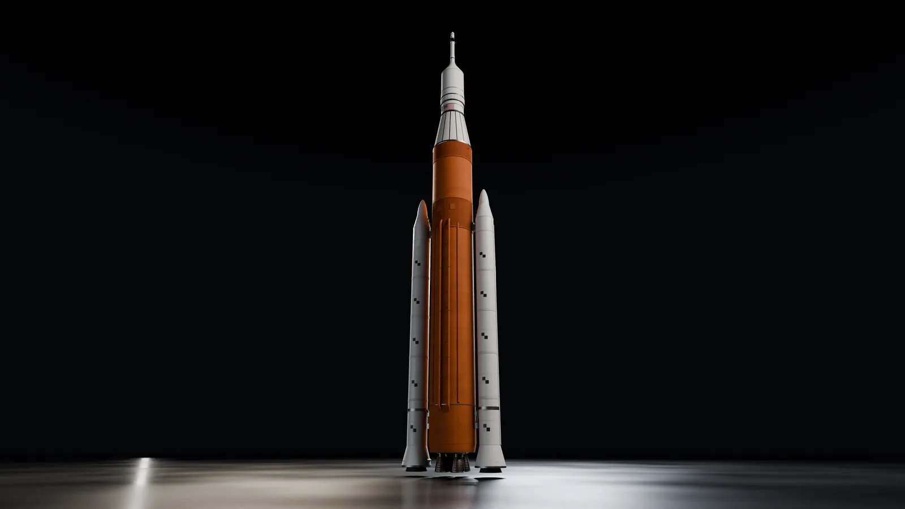
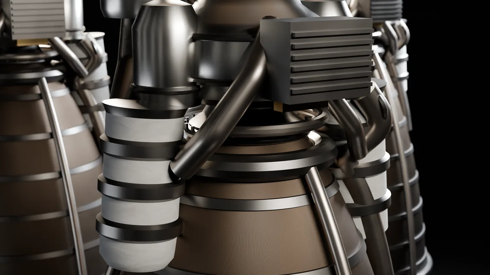
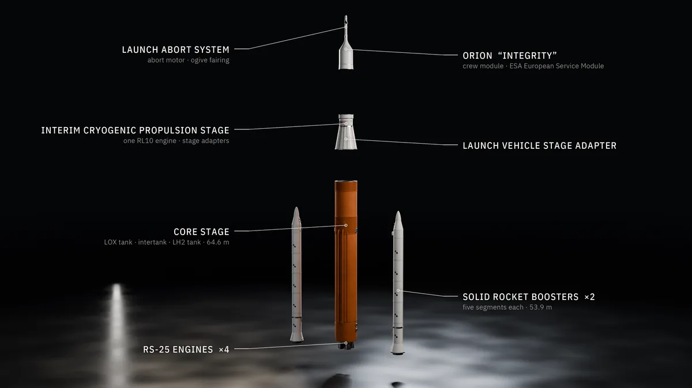
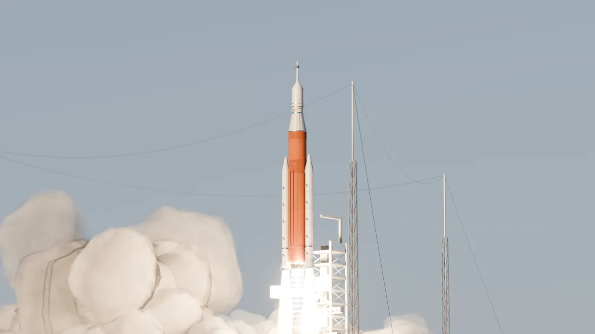
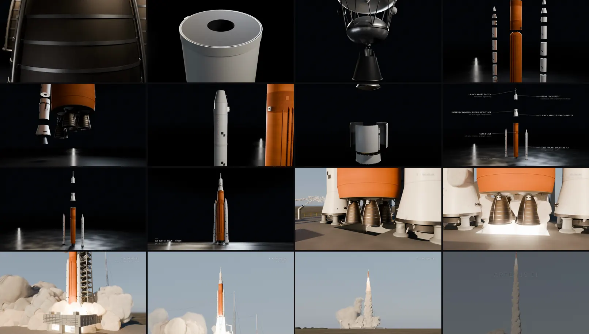

# ARTEMIS II — Built for the Journey

An 89-second CGI film built entirely in Blender from Python. NASA's Artemis II
launch vehicle is the SLS Block 1 crew configuration, with the ICPS and Orion
*Integrity*. It starts as individual engineered parts in a dark studio,
resolves into subassemblies, and integrates into the complete 98-meter stack.
Then it match-dissolves to Launch Complex 39B for an engine start and liftoff
paced in real time. The arc is **precision → scale → power**. The sound design
is original and procedural.



| | |
| :--- | :--- |
| **Model** | Claude Opus 5.5 (Claude Code, cloud session) |
| **Brief** | [`brief.md`](brief.md). One prompt; the second message was a permission approval mid-run, and the third changed only the repository layout |
| **Wall clock** | about 16 h 30 min (19:17 UTC 2026-09-26 to 11:49 the next day), including about 13 h of rendering and the re-renders after review |
| **Full-size outputs** | [release `run-artemis-ii`](https://github.com/davisbuilds/oneshots/releases/tag/run-artemis-ii): the film (master and web copy), four 3840 × 2160 stills, the `.blend`, the soundtrack, the review animatic |
| **Process** | [`process/PROGRESS.md`](process/PROGRESS.md), [snapshots](process/snapshots/) (41, including before/after pairs for each fix made after review) |
| **Research** | [`REFERENCE.md`](REFERENCE.md): reference sheet, station layout, component hierarchy and sources, every fact tagged verified, derived or estimated |

<p>
  
  
  
</p>

Full-resolution details from the 4K stills:
- [RS-25 powerhead](preview/detail-rs25-powerhead.webp) and [tube-wall nozzle](preview/detail-rs25-nozzle-tubes.webp)
- [labels and leader lines](preview/detail-labels.webp)
- [Orion and the Launch Abort System](preview/detail-orion-las.webp)
- [intertank and booster forward assemblies](preview/detail-intertank-boosters.webp)
- [liftoff plumes](preview/detail-liftoff-plume.webp)

The film, frame by frame across its 89 s:



This is an **independent visualization**. It is not produced by, endorsed by or
affiliated with NASA or ESA.

## Reproduce

From this directory, with Python 3.11 (the `bpy` wheel requires it) and ffmpeg on `PATH`:

```bash
python3.11 -m venv venv && . venv/bin/activate
pip install -r requirements.txt
python src/build_all.py      # every output, in order, into output/ (resumable)
python src/verify.py         # sizes, frame counts, checksums, .blend structure
python src/previews.py       # regenerate preview/ from output/
```

`build_all.py` runs the following steps in order:

1. `build.py` builds the scene and writes `output/artemis_ii.blend`.
2. `render.py` renders both scenes as resumable PNG sequences.
3. `export_tracks.py` exports the labels' 2-D anchors.
4. `sound.py` synthesizes the soundtrack.
5. `assemble.py` does the edit and typography and encodes the master.
6. ffmpeg makes a two-pass web copy.
7. `animatic.py` renders the Workbench animatic.
8. `stills.py` renders the four stills at 3840 × 2160.
9. It writes `output/SHA256SUMS`.

Each step is skipped when all of its outputs already exist and are non-empty.
An interrupted build resumes where it stopped, including mid-sequence
(zero-byte frame placeholders are cleared first). The two Cycles renders
dominate the runtime: about 13 hours on 4 CPU cores. `--threads N` limits
Cycles threads, and `--skip-animatic` skips the review artifact and omits it
from the partial build's `SHA256SUMS`. A complete release and `verify.py` still
require all nine assets, including the animatic.

Individual steps run on their own too, for example:
`python src/render.py -- --blend output/artemis_ii.blend --scene SC_Pad --out output/frames_pad --shots S17`.
With the Blender application instead of the module, run any script as
`blender -b -P src/build.py -- --out output/artemis_ii.blend`. The decals in
`assets/decals/` are committed and can be regenerated with `python src/make_decals.py`.

**No caches are needed.** Every effect is analytic and evaluated per frame:
geometry-node particles store birth frame, velocity, drag and growth. Any frame
renders independently, and the `.blend` is fully editable.

## How it is made

### The film

| # | Time | Shot | What it shows |
| :-- | :-- | :-- | :-- |
| | | **I · Components** | |
| S01 | 0:00 | RS-25 macro | Tube-wall nozzle, hatbands, steerhorn, powerhead. Title card. |
| S02 | 0:05.5 | Booster segment | Case, field joint, fiducial target, propellant face and bore |
| S03 | 0:08.5 | Tank domes | LOX tank aft dome over the ribbed intertank |
| S04 | 0:11.2 | ICPS | RL10B-2 with stowed carbon-carbon extension, LOX tank, truss |
| S05 | 0:13.5 | Orion | Avcoat heat shield from below, then the ESM and opened SAJ panels |
| | | **II · Subassemblies** | |
| S06 | 0:16 | Core stage | Forward skirt → LOX tank → intertank → LH2 tank → engine section, joined top-down |
| S07 | 0:21 | Engines | Four RS-25s seat into the engine section in ignition order 3-1-4-2 |
| S08 | 0:25.5 | Boosters | Nozzle, aft skirt, five segments, forward skirt, frustum, nose, stacked bottom-up |
| S09 | 0:31 | Upper stack | ICPS lowers into the LVSA; Orion Stage Adapter caps it |
| S10 | 0:34 | Orion | ESM → CMA → SAJ panels close → crew module → Launch Abort System |
| | | **III · Integration** | |
| S11 | 0:38 | Exploded view | Labeled major assemblies, then converge onto their interfaces |
| S12 | 0:50.5 | Hero | Complete vehicle, low angle |
| | | **IV · Launch** | |
| S13 | 0:55 | Pad reveal | Match dissolve to the same camera move at Pad 39B (T-20 s, water on) |
| S14 | 0:59 | Deck | Rainbird water and hydrogen burn-off igniters (explicit time cut to T-10 s) |
| S15 | 1:02.5 | Engine start | RS-25 start at T-6.36 s, 120 ms apart, order 3-1-4-2 |
| S16 | 1:05.5 | Low angle | Steam boils from the trench and around the Mobile Launcher |
| S17 | 1:08.8 | Liftoff | Booster ignition at T-0, umbilical release, first motion |
| S18 | 1:12.4 | Tower clear | Long-lens tracking; clears the 108 m tower at about T+7 s |
| S19 | 1:17.4 | Plumes | Booster plumes flanking the RS-25 plumes and their Mach diamonds |
| S20 | 1:21.2 | Ascent | Early ascent and pitch toward the Atlantic; end card |

From S14 onward the film runs at real mission time; the single time cut
(T-16 s → T-10 s) is marked by the on-screen mission clock.

#### About the assembly sequence

The assembly is an **artistic exploded sequence grounded in actual hardware
interfaces**, not a reconstruction of the factory or Vehicle Assembly Building
procedure. It echoes the real order where that helps the story: the core stage's
forward join first, engines installed last, boosters stacked from the aft
skirt up, then LVSA, ICPS, OSA and Orion. But the real process differs in
important ways:

- Core stage sections are joined partly horizontally at Michoud.
- The boosters are stacked on the Mobile Launcher *before* the core stage is
  lifted in between them.
- Orion is integrated in separate facilities.
- Nothing floats in a studio.

### Pipeline

- `src/lib/config.py` holds the stations and dimensions; `src/lib/timeline.py`
  holds the shot list, frame and mission-time mapping, and launch events.
- `src/lib/{rs25,core,srb,upper,orion}.py` hold the component builders;
  `src/lib/vehicle.py` holds the hierarchy.
- `src/lib/studio.py` and `src/lib/anim_studio.py` hold the studio,
  choreography, cameras, per-shot light rigs and label anchors.
- `src/lib/pad.py`, `src/lib/anim_pad.py` and `src/lib/fx.py` hold the pad,
  launch physics, umbilicals, plumes, particles and pad cameras.
- `src/lib/render_settings.py` holds the Cycles presets and compositor (mist
  haze, fog glow).
- `src/build_all.py` runs every step in order; `src/verify.py` checks a build;
  `src/previews.py` writes `preview/`.
- `src/assemble.py` handles the edit, typography and encode;
  `src/sound.py` handles sound; `src/audio_report.py` makes the audio
  inspection plot.

The `.blend` contains two scenes that share the `SLS_Vehicle` collection.

- **`SC_Studio`:** frames 1–1345.
- **`SC_Pad`:** frames 1321–2137.
- Camera switching is bound to timeline markers.

Collections are named per assembly: `CoreStage`, `RS25_Engines`,
`SRB_North`, `SRB_South`, `UpperStack` and `Orion`. Each part's origin sits on
its interface ring, so an exploded offset is a pure translation.

### Render settings

- Cycles on CPU (4 cores, no GPU available).
- Rendered at 1600×900 with adaptive sampling:
  - studio: 12 samples;
  - pad: 10 samples, with motion blur on the launch shots.
- OpenImageDenoise with albedo and normal guides; AgX view transform.
- Upscaled with Lanczos plus a light unsharp mask to the 1920×1080 master.
- 4K was benchmarked and was not practical for the full film on this
  hardware (about 1–4 CPU-minutes per 4K frame). The four stills are rendered
  natively at 3840×2160 with 40 samples.
- Final render: 2,162 frames (1,345 studio, 817 pad) in about 13 hours of
  wall-clock time on 4 CPU cores, with both scenes rendering side by side.
  That is 25–50 s per studio frame and 16–150 s per pad frame on 2 threads;
  liftoff is the heaviest. It excludes look-dev and the 547 superseded frames
  that were re-rendered after review (see the [progress log](process/PROGRESS.md)).
- Soundtrack: −19.9 LUFS integrated, −0.5 dBTP, 9.9 LU loudness range. It is
  deliberately dynamic, so the launch is the loudest moment.

### Stills

| Still | Scene frame | Moment |
| :-- | :-- | :-- |
| `01_engine_detail` | SC_Studio 118 | RS-25 powerhead and tube-wall nozzle, 0:04.9 |
| `02_exploded_assembly` | SC_Studio 1064 | Labeled exploded view, 0:44.3 |
| `03_complete_vehicle` | SC_Studio 1296 | Hero, complete stack, 0:54.0 |
| `04_launch` | SC_Pad 1812 | Rising past the tower, T+6.5 s |

### Tools actually used (all executed in the run)

- Python 3.11, **Blender 5.0.1 as the `bpy` module** (PyPI wheel), Cycles on
  CPU (4 cores, no GPU) with OpenImageDenoise. Workbench, on Mesa llvmpipe,
  rendered the animatic.
- NumPy 1.26, SciPy 1.17 (sound synthesis and filtering), Pillow 12.3
  (typography, overlays, previews), FFmpeg 6.1 (libx264, AAC).
- IBM Plex typefaces, fetched from the npm registry and converted from WOFF2
  with fontTools.
- No image- or video-generation models, and no downloaded meshes, textures,
  artwork or audio. Every decal is drawn by `src/make_decals.py`.

## Accuracy notes and disclosures

**Real-world scale.** Everything is built in meters at 1:1. Vehicle stations
are derived from verified NASA/ESA dimensions, listed with their provenance
in [`REFERENCE.md`](REFERENCE.md).

**Geometric simplifications (public references don't support accurate internals):**

- **RS-25:** the nozzle uses a Rao-style bell contour fitted to the published
  length, throat and exit diameters. The powerhead, turbopumps, ducts and
  controller are simplified shapes arranged after the familiar SSME layout.
- **Core stage:** stringer counts, weld lands, access doors, umbilical plates,
  antennas and feedline brackets are representative. Section heights come from
  a fit to the 212 ft total with 0.707 elliptical domes. The internal thrust
  structure is schematic.
- **Boosters:** the segment and skirt split is fitted to the 177 ft length.
  Propellant grain faces and bores at the segment ends are simplified; the
  forward segment gets an 11-point star bore.
- **ICPS:** layout follows the Delta Cryogenic Second Stage. The RL10B-2
  extension is shown stowed, which is **inferred**: the published 45 ft ICPS
  length only fits the 322 ft stack if it is stowed on the pad.
- **Orion:** heat-shield curvature uses an Apollo-derived R/D ≈ 1.2. The ESM
  is an exterior envelope only: MLI, four stowed wings, OMS-E, 8 auxiliary
  thrusters and 6 RCS pods. SAJ panel count and orientation, LAS nozzle
  cant angles and window placement are estimates.
- **Mobile Launcher 1:** exhaust openings (two booster holes and one core
  hole), lattice members, rainbird positions, igniter positions and deck
  hardware are schematic. Umbilical arms are placed at their published
  levels, but arm geometry is generic.
- **Pad 39B:** mound, trench and deflector use published figures (58 ft wide
  trench, ~58° north-facing deflector, 55 ft hardstand). Lightning towers,
  water tower, propellant spheres and site layout are approximate.

**Markings:**

- The NASA "worm" on the boosters (rotated 45° toward the front, per Artemis
  II) and on the crew module adapter is a **hand-built approximation of the
  logotype**, not the official artwork.
- The "esa" plate is a simplified generic stand-in for the ESA insignia.
- The US flag on the ICPS is drawn to the standard proportions; its exact
  placement is estimated.
- Fiducial checkerboards on all booster segments are representative in size
  and position.
- The **America 250 emblem** carried on Artemis II's boosters is **not
  reproduced**, because its design details could not be verified here.

**Artistic liberties:**

- The dark studio, floating parts and exploded choreography.
- Label typography.
- The single explicit countdown time cut.
- Exhaust clouds biased north and east (the deflector sends exhaust north)
  so they don't bury the camera.
- The pitch program shape and ENE heading after tower clear.
- Procedural steam and smoke, not a fluid simulation.
- Additive emission plumes, not combustion physics.

**Unverified or assumed:**

- The ML tower sits **east** of the vehicle, with boosters north and south.
- LOX feedline azimuths and RS-25 position numbering. Only the diagonal
  3-1-4-2 start pattern is verified.
- The lateral booster spacing.
- The hydrogen burn-off igniter positions.
- Thrust and mass figures used for the ascent profile (≈36.8 MN at liftoff,
  2.61 × 10⁶ kg, 14 t/s).

**Lighting.** The pad scene is lit to match the actual launch time: 1 April
2026, 18:35 EDT, 13.5° sun elevation at 268° azimuth, computed for LC-39B.
Everything else about the launch is a visualization, not a reconstruction of
the real event.

## Process notes and limitations

- **Release assets are uploaded by hand.** The full build is about 13 hours of
  Cycles rendering on 4 CPU cores and needs ffmpeg, so it does not fit the
  **Run assets** workflow (120-minute job, pip-only install). The assets are
  the files the run itself produced, published to `run-artemis-ii` with a
  `SHA256SUMS` that `src/build_all.py` writes and `src/verify.py` checks.
- **Some shots use earlier distant scenery.** The launch shots S13–S19 were
  rendered before the distant tree line was rebuilt, so they show its earlier
  box silhouettes. Those sit behind those cameras or at the hazy horizon.
  Re-rendering them from the final `.blend` changes only those far silhouettes.
- **The animatic is a review artifact.** It was made before the post-review
  fixes, so its choreography and effects are earlier versions. A rebuild with
  `build_all.py` makes an animatic of the final scene instead.
- **Weak spots the agent still sees:**
  - The steam and exhaust clouds are procedural puffs, not a fluid
    simulation. At close range some still read as soft lumps.
  - Rainbird droplets near the S14/S15 cameras look like white flakes.
  - The pad ground beyond the mound is a flat textured plane.
  - The studio floor shows a bright reflected light-bar streak in several shots.
- **Research was limited to web-search summaries.** The environment's
  network policy blocked nasa.gov, esa.int, Wikipedia and
  download.blender.org, so official diagrams and photographs could not be
  opened. `REFERENCE.md` marks which figures are verified, derived or
  estimated.
- **The progress log's times are reconstructed.** They come from the session
  transcript and commit times; during the run they were rough session-relative
  guesses.
- **The original run did not record the exact model identifier.** The owner
  subsequently confirmed Claude Opus 5.5; `run.toml` records that attribution.

## Sources

See [`REFERENCE.md`](REFERENCE.md#sources) for the full list: NASA
Artemis II press kit, SLS, core stage, booster, RS-25, ICPS, LVSA and OSA fact
sheets; ESA and NASA European Service Module pages; Orion by the Numbers; the
Launch Abort System reference; Mobile Launcher 1 and umbilicals fact sheets;
the LC-39B reference; NASA marking articles; and launch-day coverage.

Fonts: IBM Plex Sans, Sans Condensed and Mono, © IBM, SIL Open Font License
1.1 ([`assets/fonts/OFL-IBM-Plex-LICENSE.txt`](assets/fonts/OFL-IBM-Plex-LICENSE.txt)). All sound is synthesized
by `src/sound.py`; no samples or third-party audio were used.
