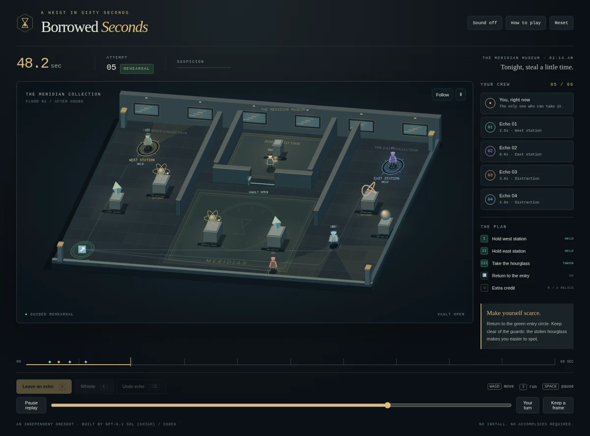

# Borrowed Seconds

**One minute. More than one you.** A midnight museum heist in which your past
selves are your accomplices. Leave an echo holding a security station, rewind,
recruit another you, and take the hourglass while your crew distracts the guards.



More views: [opening](preview/title.webp) · [phone](preview/phone.webp) ·
[vault detail](preview/detail-vault.webp).

One HTML file. No install, server, external libraries, fonts, images, audio
samples, or network requests. All artwork is drawn in Canvas 2D; sound is
synthesized with Web Audio.

**Model:** GPT-6.1 Sol (xhigh), in Codex. Attribution confirmed by the curator
after the run; the exact model identifier remains unrecorded.

## Play

Open [index.html](index.html) directly in a modern browser. **Watch a plan**
demonstrates a complete five-person heist using the same simulation as play.
**Begin the heist** starts with an empty crew.

1. Click the gold **west station**. Once you're standing on it, press **R**.
2. Reach the blue **east station**, using the south hall, and press **R** again.
3. On your next attempt, let both echoes arrive at their stations. The vault's
   red laser barrier opens. Walk inside and press **E** near the hourglass.
4. Return to the green entry circle before the sixty seconds expire.

Echoes repeat their recorded routes and whistles, then hold their final
positions. You do not have to wait out the minute before recording. Up to
five echoes can join you; remove an individual recording from the crew list
or undo the latest one.

Guards investigate echoes and whistles, but only the current thief can be
caught. Stay outside the amber cones, use displays and walls for cover, and
remember that running makes noise. Suspicion decays when you leave their sight.

For **grand larceny**, also lift **The First Moon** in the west wing and
**Entanglement** in the east wing. Press E near either display and bring all
three treasures home on the same attempt. These two relics are optional.

## Controls

| Input | Action |
| :---- | :----- |
| Click / tap the floor | Walk to a destination, navigating around walls and displays |
| WASD / arrows | Move in screen directions |
| Shift | Run; nearby guards can hear it |
| R / Leave an echo | Record your route and reset the minute |
| E / contextual action button | Take a nearby treasure, otherwise whistle |
| Space / P | Pause / resume |
| Backspace / Undo echo | Remove the newest echo and reset the minute |
| × beside an echo | Remove that recording and reset the minute |
| Map / Follow | Switch between the whole museum and a camera following you |

Touch movement and action buttons stay at the bottom of the phone viewport.
The phone starts in follow view; **Map** shows the whole floor so you can
choose a distant destination. Opening the field guide, leaving the tab, or
blurring the window pauses the heist.

Sound starts only when enabled. A confirmation peal makes activation audible.
The soundtrack is a quiet procedural pulse, with cues for whistles, locks,
rewinds, detection, pickups, and extraction.

After a successful escape, **Watch the replay** reruns the crew's actions.
The replay slider reconstructs the museum from the beginning, including
guard decisions and pickups, and pauses at the selected moment. **Keep a
frame** exports the current museum canvas as a PNG.

## How time works

The production simulation advances at a fixed 60 Hz. A recording stores one
pose per tick, together with timestamped interaction events. Echoes are
temporal projections: their recorded positions are immutable, they cannot
be caught, and they cannot carry treasure. Whistles are replayed as real
events that change the current guards' behavior. Station occupancy is computed
from the positions of all actors on every tick.

Rewinding resets guards, suspicion, locks, artifacts, and the live thief.
Recordings are kept. A captured route can be retained as an echo; retrying
without recording preserves the existing crew. The run ends at extraction,
capture, or exactly 3,600 simulation ticks.

Navigation uses an eight-neighbor A* grid, with line-of-sight path smoothing
and collision checks against expanded obstacles. Guards patrol fixed routes,
investigate audible positions, and react to visible echoes. Their sight is
limited by angle, distance, and occlusion against museum walls and displays.
No random numbers influence the security simulation. Decorative dust and
sculpture motion use a separate presentation clock.

The successful live route and its interactions are replayed against the
same initial world and crew. This reproduces the security simulation rather
than displaying a video of it.

## Verification

From the repository root, using its locked optional browser tooling:

```bash
npm ci
npx playwright install chromium
node runs/borrowed-seconds/verify.mjs
```

The verifier uses the actual `file://` artifact in Chromium. `?test=1` exposes
a small inspection and fixed-step interface; ordinary play does not expose it.
Pointer routes, action buttons, keyboard shortcuts, sound, and touch direction
buttons still enter through the normal game handlers.

Checks cover a complete three-treasure escape, exact replay of thief and guard
states, replay scrubbing, the five-person demonstration, recorded whistles,
solid walls and the locked vault, stationary echo endpoints, the crew limit,
capture, sixty-second expiry, retry, undo and removal, pause, sound output,
PNG export, phone input, rotation with movement/action controls inside the viewport, reduced-motion startup, and the ordinary
animation loop. It also rejects browser errors and external HTTP requests.
Browser evidence stays in ignored `output/playwright/`.

## Process notes and limitations

The [brief](brief.md), [progress log](process/PROGRESS.md), and
[numbered snapshots](process/snapshots/) record the development.

- One handcrafted museum, with an optional larger theft; no procedural levels.
- Echoes are projections of poses and whistles, not independent physical
  simulations or paradox-resolving agents. Security can change around them.
- The guards use deliberately readable patrol, hearing, and vision rules.
  They do not model real surveillance or coordinate a search.
- The museum is a projected 2D collision world with drawn heights. Wall
  occlusion is two-dimensional; the view is not a full 3D renderer.
- Playback is reproducible on the same browser execution path; cross-browser
  floating-point bit identity is not claimed.
- The crew lives in memory. Refreshing or resetting the entire heist clears it.
- Tested on desktop and phone-size Chromium, including touch emulation and
  reduced motion. Real phone hardware and other browser engines were not tested.
