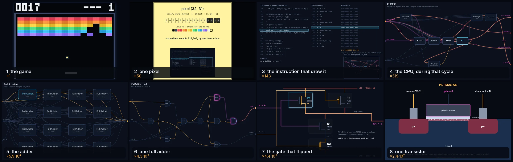
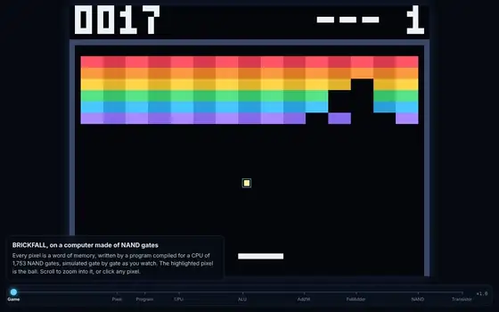
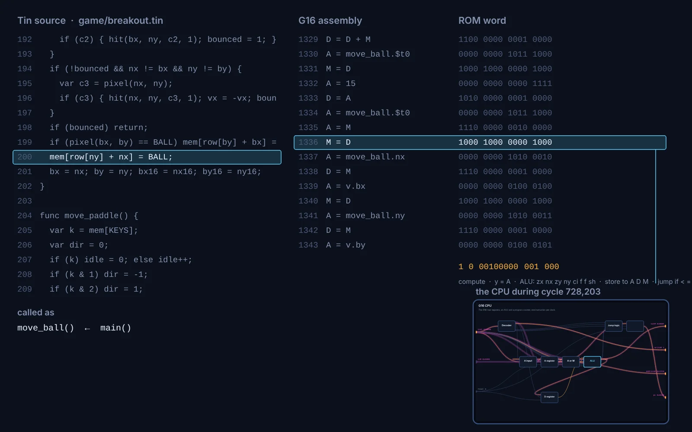
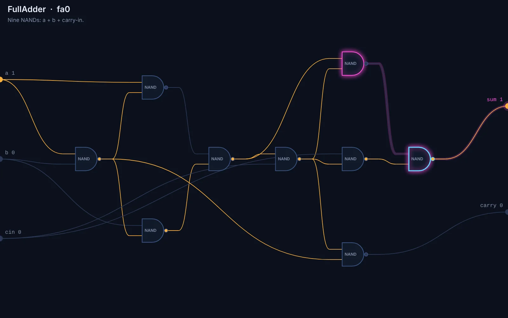
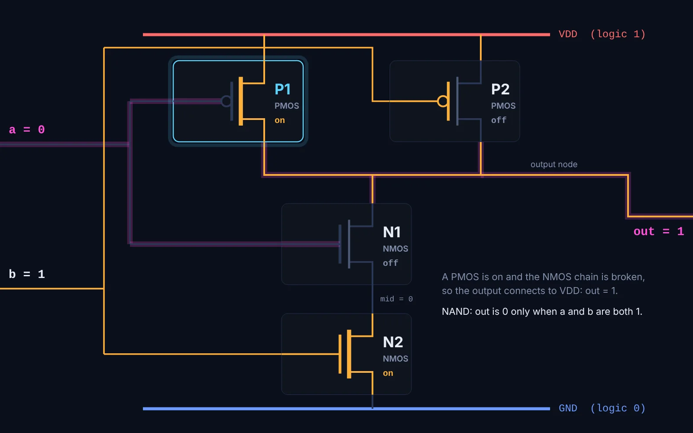
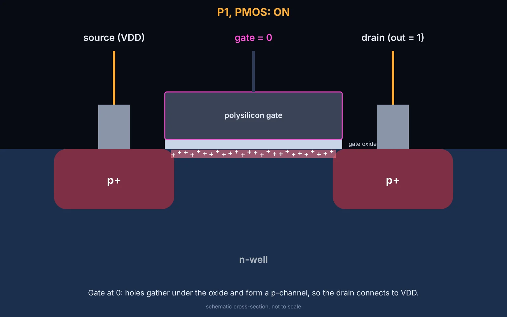

# From Gate to Game

A computer built from nothing but NAND gates, with an assembler, a compiler and
a game for it, all written for this run and all running in one web page. The
CPU is 1,753 NAND gates, simulated gate by gate while you play. Scroll, and the
view zooms continuously from a pixel of the game into the instruction that drew
it, the CPU during that one clock cycle, the adder inside its ALU, the gate
whose output flipped, and the transistor inside that gate: about 24 million
times magnification, in nine steps. Every layer has its own test suite.



| | |
| :--- | :--- |
| **Open it** | [`index.html`](index.html): no install, no server, no network |
| **Model** | Claude Opus 5.5 (Claude Code, cloud session) |
| **Brief** | [`brief.md`](brief.md): one human turn |
| **Wall clock** | about 1 hour |
| **Full-size outputs** | release `run-gate-to-game`: the guided tour as a 51 s film, built by the Run assets workflow ([below](#reproduce)) |
| **Process** | [`process/PROGRESS.md`](process/PROGRESS.md), [snapshots](process/snapshots/) |



## Open it

`open index.html` (or double-click it). The game, BRICKFALL, plays itself when
nobody touches it; arrow keys or A and D take over the paddle and space
launches the ball. On a phone, use the buttons under the caption.

- **Scroll** (or pinch, or drag up and down) to zoom. The highlighted pixel is
  the ball; click any other pixel to follow that one instead.
- **Click** any chip, gate or transistor on the way down to send the path
  through it.
- **Take the tour** for a captioned dive from the game to a transistor and
  back.
- **Slow motion** (`S`) replays the chosen cycle one gate delay at a time:
  values sweep out from the registers and down the adder, and pink marks the
  wave of change.
- `+` and `−` move one level, `Esc` returns to the game, `P` pauses the CPU.
  The ruler at the bottom jumps to any level.

Once you zoom past the pixel, time stops: the CPU holds still in the cycle you
are looking at, and resumes when you come back out.

<p>
  
  
  
  
</p>

## The stack, and what proves each layer

| Layer | What it is | Test | What the test shows |
| :-- | :-- | :-- | :-- |
| Transistors | switch-level CMOS ([`src/transistor.js`](src/transistor.js)) | [`01-transistor`](tests/01-transistor.test.js) | four transistors make a NAND that never floats or shorts; a broken cell is caught; the ALU expanded to 3,136 transistors agrees with the gates net for net |
| Gates | an HDL whose only primitive is NAND ([`src/hdl.js`](src/hdl.js)), 37 chips from Not to the whole computer ([`src/chips.js`](src/chips.js)) | [`02-gates`](tests/02-gates.test.js), [`02b-ram`](tests/02b-ram.test.js) | every chip against its own spec, exhaustively up to 14 input bits; RAM512 and the 1,134,523-gate RAM4K store and return words; the whole computer, CPU plus RAM, 1,136,320 NANDs, runs a compiled program in lockstep with the reference |
| CPU | the G16 ([`src/isa.js`](src/isa.js) is its spec) | [`03-cpu`](tests/03-cpu.test.js) | 100,000 random instructions, every output every cycle; every clock phase settles in one sweep; 400 cycles rebuilt net-for-net from the registers alone; random stuck-at faults caught (223 of 228) |
| Assembler | [`src/asm.js`](src/asm.js) | [`04-asm`](tests/04-asm.test.js) | encodings; every accepted expression computes what it says; all 32,768 compute words disassemble and reassemble to the same behaviour |
| Compiler | Tin, a small C-like language ([`src/tin.js`](src/tin.js)) | [`05-compiler`](tests/05-compiler.test.js) | arithmetic, precedence and wrapping; `*` `/` `%` against JavaScript on random operands; control flow, short circuits, calls; errors with line numbers; the same program on the gate CPU |
| Game | BRICKFALL ([`game/breakout.tin`](game/breakout.tin)) | [`06-game`](tests/06-game.test.js) | the screen it draws, the keys, the autopilot, losing and restarting; **a million cycles of play on the NAND CPU identical to the reference, all 40,785 memory writes in order** |
| Zoom | layouts, the trace, the camera ([`src/layout.js`](src/layout.js), [`src/trace.js`](src/trace.js), [`src/scene.js`](src/scene.js)) | [`07-view`](tests/07-view.test.js), [`verify.mjs`](verify.mjs) | every schematic fits and is fully wired; for hundreds of pixels the traced cycle really writes that pixel and the chosen gate really flipped; the slow-motion replay settles on the fast simulator's exact state; the camera is continuous at every level boundary; in a real browser, every level renders and every control works, on desktop and phone |

### The G16

An accumulator machine in the family of the Hack computer from Nand2Tetris:
registers A and D, memory M at address A, one instruction per clock, and the
ALU's control bits taken straight from the instruction. Its ALU is its own:
both operands can be zeroed and inverted, then it computes x + y + carry-in,
x AND y, x OR y or x XOR y, and can shift the result right by one. The
256 control settings compute 65 distinct functions.

```
0vvv vvvv vvvv vvvv   A = v
1mzn zncf fsAD Mleg   r = ALU(D, m ? M : A); store r in A, D and/or M; jump if r < 0, = 0, > 0
```

The board has 4K words of RAM, a 64 × 48 screen (one word per pixel, a colour
from a 16-colour palette), a key register and a 60 Hz frame counter, memory
mapped. The program is in a ROM.

### The assembler

`D = D + M`, `AM = M - 1`, `D ; jgt`, `M = (D + M) >> 1`. Rather than a table
of permitted forms, the assembler evaluates the expression on 40 pairs of test
operands and picks the ALU setting that behaves the same, so anything the ALU
can compute is accepted, and anything it cannot is refused with a reason.

### Tin

```
var font[] = {0x7B6F, 0x749A, ...};
func draw_digit(d, x, y) {
  var g = font[d];
  ...
}
```

Constants, globals, arrays, functions, `if`/`while`/`for`, C's operators and
precedence with short-circuit `&&` and `||`, and `mem[a]` for the whole
address space. Every variable, parameter and temporary has a fixed address, so
calls are a few instructions and expressions need no stack; in exchange there
is no recursion, which the compiler detects and refuses with the cycle in the
message. Multiplication, division and variable shifts are a runtime written in
Tin itself.

### The game

BRICKFALL is 260 lines of Tin, 1,855 words of ROM and 187 words of RAM. It
keeps no map of the bricks: the ball reads the colour of the pixel it is about
to enter, so the screen is the collision map. Ball physics is fixed point in
sixteenths of a pixel, which is where the CPU's free shift-right earns its
place. A typical frame takes 64 cycles; a brick hit with a score redraw about
2,000; the page clocks the CPU at 2,000 cycles a frame (120 kHz), and lowers
that on a device too slow to simulate it.

## How the zoom works

Every level is a 1600 × 1000 frame, and each sits inside a 16:10 rectangle of
the level above: the pixel inside the screen, the program card inside the
pixel, the CPU inside the program card, and then each chip's schematic inside
its own box in its parent's schematic, down to each NAND, whose box holds its
four transistors, each of whose boxes holds a cross-section. The camera
position is a single number, the logarithm of the magnification. Between two
levels the camera scales about the fixed point of the map from a frame to its
anchor, so the target grows in place, as in Powers of Ten. Drawing starts a
level above the camera and recurses inward, culling whatever is off screen or
too small, so the whole hierarchy is drawn wherever it is large enough to see,
not only along the path.

What the levels show is real data from one cycle. Every write to the screen
logs the cycle and the CPU's registers at its start and at the start of the
cycle before. From those, a second copy of the CPU netlist is loaded through
its "scan path" (the flip-flops written directly, as chips are tested in the
fab) and settled, giving the value of every one of the 1,789 nets in both
cycles; the nets that differ are what flipped. The trace walks back from the
CPU output that made the write through gates whose output flipped, and lands
on the first one in the adder if the change passed through it, otherwise on
the deepest one. In that gate, the transistor shown is the one whose input
flipped and which now conducts.

Slow motion re-runs the cycle with every gate taking one unit of time, all
gates updated together from the previous step. It settles in about 20 to 30
gate delays, and about 80 nets change more than once on the way (glitches).

## Reproduce

Everything is plain JavaScript; the page and the tests have no dependencies.

```bash
node --test tests/*.test.js     # all layers, about 45 s (most of it the 1.1M-gate RAM tests)
node tools/embed.js --check     # src/game.js matches game/breakout.tin
node tools/shot.js 600 output/shot.ppm   # play 10 s headless, write the screen
```

The browser verifier and the film need the repository's locked Playwright
(`npm ci` and `npx playwright install chromium` at the repository root):

```bash
node verify.mjs                 # real-browser checks; screenshots in output/playwright/
node tools/film.mjs             # the tour film, output/gate_to_game_tour.mp4
```

`CHROMIUM_PATH` points either at another Chromium build. The film needs an
FFmpeg with libx264 (`FFMPEG`, or `ffmpeg` on the path); the release build
takes it from the `imageio-ffmpeg` wheel in [`requirements.txt`](requirements.txt).
The film is declared as a release asset and is built from this source by the
Run assets workflow, which also runs the test suite and checks the film; the
file was rendered and checked locally (1,534 frames, 51.1 s, 1280 × 800) but
not published from this session.

Source layout: [`src/`](src) holds one script per layer, loaded in order by
`index.html` and by [`src/node.js`](src/node.js) for the tests;
[`src/game.js`](src/game.js) is generated from the game's source by
[`tools/embed.js`](tools/embed.js), because a page opened from disk cannot
fetch files. The page compiles the game with the Tin compiler when it loads.

## Process notes and limitations

- **Memory is simulated by its behaviour in the page.** The RAM chips are
  built from NAND and tested at gate level, including the 1.13-million-gate
  RAM4K and the whole computer, but in the page only the CPU runs as gates;
  the RAM, screen and ROM are arrays. The ROM is never NAND gates at all: it is
  the cartridge.
- **The simulator is a logic model, not an electrical one.** Gates are
  evaluated with zero delay in two clock phases; slow motion uses a
  unit-delay model. Neither knows real gate timing, fan-out or wire delay, and
  the transistor layer is switch-level: on or off, no currents or voltages in
  between. The cross-section is a schematic, not to scale.
- **"The gate that flipped" is one choice among several hundred.** A typical
  cycle flips 200 to 450 of the 1,753 gates. The trace's rule (the first gate
  in the adder on the chain of flips from the write, else the deepest) is a
  rule of mine, chosen because it tells the clearest story; clicking re-aims
  the path anywhere.
- **Tin's limits:** no recursion; comparisons subtract, so they are wrong when
  the operands are more than 32,767 apart; `/` and `%` of −32,768 are not
  handled. The game never comes near either.
- **Fault coverage is a sample:** 223 of 228 random stuck-at faults caught in
  6,000 random cycles (stuck-at-1 faults on NOT-gate inputs are excluded
  because they change nothing). The five escapes are in rarely exercised
  logic, such as high bits of the program counter's incrementer.
- **Phones:** the frames are 16:10, so a portrait phone shows them at the
  width of the screen with room to spare above and below.
- Screenshots from my first look at the page were overwritten when I re-ran
  the script after fixing the layout, so the snapshots start after that fix;
  the log describes what the first look showed.
