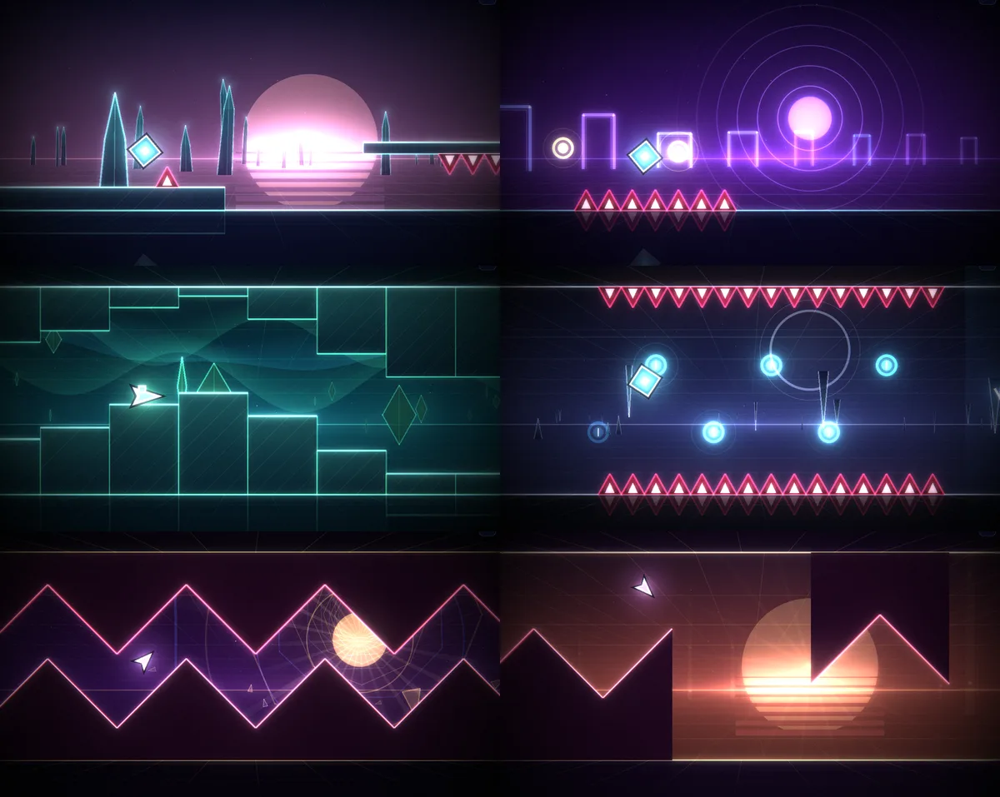

# Luminal

**One button. One song. One run of light.** A rhythm platformer in the spirit
of Geometry Dash, with its own art, music and level. *Heliotrope* is a
two-minute journey through seven worlds of luminous geometry. Every spike,
ring and portal sits on a beat of an original soundtrack, which is
synthesized in your browser when the page loads.



More views: [title](preview/title.webp) · [phone](preview/phone.webp) ·
[Dawn](preview/detail-dawn.webp) · [Inversion](preview/detail-inversion.webp) ·
[the drop](preview/detail-drop.webp), each at full resolution.

| | |
| :--- | :--- |
| **Play it** | open [`index.html`](index.html): no install, no server, no network, about 160 KiB of code |
| **Share it** | `node tools/bundle.mjs` writes `output/luminal.html`, the whole game in one file |
| **Model** | Claude Opus 5.5 (Claude Code, cloud session) |
| **Brief** | [`brief.md`](brief.md): one human turn during the run, and one after delivery asking for the pull request |
| **Full-size outputs** | release `run-luminal`: the single-file game and the soundtrack as WAV, built by the Run assets workflow ([below](#reproduce)) |
| **Process** | [`process/PROGRESS.md`](process/PROGRESS.md), [snapshots](process/snapshots/) |

## Play

Open `index.html` in a current desktop or mobile browser (Chrome, Edge,
Firefox, Safari). It needs WebGL2. The soundtrack takes about a second to
synthesize before **Play** lights up; the rest renders in the background while
you play.

| Input | Action |
| :-- | :-- |
| <kbd>Space</kbd>, <kbd>↑</kbd>, <kbd>W</kbd>, click, tap | jump; hold to keep jumping. Fly the ship, steer the wave |
| <kbd>Esc</kbd> or <kbd>P</kbd> | pause |
| <kbd>R</kbd> | restart |
| <kbd>Z</kbd> / <kbd>X</kbd> | practice mode: place / remove a checkpoint (also on screen) |
| <kbd>M</kbd> | mute |

- **Normal mode** counts attempts, records your best percentage, and keeps a
  heat map of where your runs end (on the title screen). A gold line in the
  world marks your best.
- **Practice mode** restarts from your latest checkpoint, with the music picking
  up from the same beat. Checkpoints are placed automatically every two bars
  once you have survived past them, or by hand with <kbd>Z</kbd>.
- Progress lives in your browser's local storage. **Settings** has volume,
  flashes, screen shake (both off by default if your system asks for reduced
  motion), automatic checkpoints, an audio offset for Bluetooth headphones,
  and a reset.
- **Watch** plays the whole level along the route the solver found (nothing
  is recorded). `?autoplay` in the address does the same for any mode.

## The level

| | Section | Bars | What it teaches, then asks |
| :-- | :-- | :-- | :-- |
| I | **Dawn** | 0-7 | jumping on the beat, holding to bounce, *not* jumping under hanging spikes, a syncopated jump |
| II | **Pulse** | 8-15 | yellow rings (tap in mid-air), pads, floating platforms |
| III | **Ascent** | 16-23 | the ship, in four open bars before any wall; then the wave, flat before it zig-zags |
| IV | **Inversion** | 24-31 | gravity portals, blue rings that flip gravity, a chain of rings on eighth notes as the build-up rolls |
| V | **Supernova** | 32-47 | the drop, faster: the wave zig-zags on every eighth note, the ship flips gravity, then cube, rings and pads at speed |
| VI | **Echo** | 48-51 | a breath: slow, three jumps, each on a bell note |
| VII | **Ascension** | 52-59 | the song lifts a whole step and the level replays everything in quick succession |
| VIII | **Afterglow** | 60 | the gate of light, on the final E major chord |

The world is built around the music, not decorated with it. A ground jump
lasts exactly one beat, so holding the button bounces on the beat. The level
is written in beats (`b.spikes(24.5)` is a spike you pass half a beat after
pressing on beat 24), and each section's backdrop pulses with the kick and
flashes on the crashes. Hazards are always the same white-cored red, and no
section uses that red anywhere else.

## How it is made

| File | What it is |
| :-- | :-- |
| [`src/core.js`](src/core.js) | tempo (128 BPM), speeds, jump and hitbox constants |
| [`src/physics.js`](src/physics.js) | the simulation: one fixed 1/240 s step for cube, ship and wave, orbs, pads, portals |
| [`src/builder.js`](src/builder.js), [`src/level.js`](src/level.js) | the vocabulary for writing a level in beats, and *Heliotrope* itself |
| [`src/song.js`](src/song.js) | the soundtrack as note events: 64 bars, an eight-bar hook, D minor lifting to E minor |
| [`src/audio.js`](src/audio.js) | the synthesizer (kick, clap, hats, bass, pads, leads, bells, risers) and playback |
| [`src/render.js`](src/render.js) | a WebGL2 batch renderer with bloom, flash and chromatic aberration |
| [`src/world.js`](src/world.js), [`src/scene.js`](src/scene.js) | the perspective backdrops, the level geometry, the player |
| [`src/game.js`](src/game.js) | input, the audio clock, attempts, practice, saving, menus |
| [`src/route.js`](src/route.js) | one proven route through the level (generated) |

**Synchronization.** The player's x position is a function of song time, never
integrated, so the world cannot drift from the music. The soundtrack is
rendered offline in eight-bar chunks with every note at its exact sample;
chunks play as scheduled buffer sources on the audio clock, and a restart or
practice respawn seeks to the exact beat. The game reads its clock from the
audio context, smoothed between the audio clock's coarse updates. Key and
touch events are timestamped and applied to the 1/240 s step they belong to,
not the next frame.

**Fair hitboxes.** The player is a 1 × 1 box. A spike's hitbox is a 0.3 × 0.5
rectangle low in the triangle, so any death means the box really overlapped
the drawn spike (tested). A block kills only when the inner 30% of the player
enters it; shallower contact snaps onto the surface. Wave walls are drawn as
polygons and collide as a staircase inset inside the drawn shape. A press
up to 90 ms before landing still jumps, and so does one up to 50 ms after
running off an edge.

## Proof that it can be finished

[`tools/solver.js`](tools/solver.js) searches over button states with the game's
own `step()`: every few steps each surviving state branches into held and
released, and nearby states merge, keeping the one reached with the fewest
button changes. [`tools/solve.js`](tools/solve.js) writes the route it finds to
`src/route.js`.

- [`tests/level.test.js`](tests/level.test.js) replays that route through the
  real physics to the finish, and, from the route's state at each of 15
  section boundaries, makes the solver clear the next stretch again while
  only allowing the button to change every **50 ms**. No part of the level
  needs frame-perfect input.
- [`verify.mjs`](verify.mjs) drives the route through the page's own update,
  step by step, to the **COMPLETE** screen.
- [`tools/fairness.js`](tools/fairness.js) measures each press's timing window:
  how far it could move while some way of playing on from there still
  survives the next 1.5 s. The narrowest window in each section:

  | Dawn | Pulse | Ascent | Inversion | Supernova | Echo |
  | --: | --: | --: | --: | --: | --: |
  | 154 ms | 146 ms | 154 ms | 79 ms | 129 ms | 221 ms |

  Medians are 200 to 300 ms. Ascension's narrowest press read 0 ms because the
  route presses at the last possible moment there; probed directly it can
  move 17 ms earlier, so that number describes the route, not the level. A
  window here is a property of the input timing alone; reading the obstacles
  at speed is the rest of the difficulty.

## Checks

```bash
node --test runs/luminal/tests/*.test.js    # physics, level, song, solvability (about 20 s)
node runs/luminal/tools/solve.js --check     # the stored route still finishes the level
node runs/luminal/verify.mjs                 # the real page in headless Chromium (about 3 min)
```

`verify.mjs` (after `npm ci` and `npx playwright install chromium` at the
repository root) loads the page from disk and checks: the first music chunk
arrives and Play enables; the whole soundtrack renders, peaks below full scale,
and the drop is more than 6 dB louder than the opening; Space, the mouse and
touch reach the game through its own handlers; standing still dies on the
first spike and is recorded in the bests and heat map; a press restarts at
once; the stored route finishes the level and saves the clear; practice
checkpoints place, respawn and remove; pause resumes; progress survives a
reload; in real time the game clock stays within 30 ms of the audio clock; no
console errors and no network requests. It saves screenshots to
`output/playwright/`.

## Reproduce

The game is the committed source; nothing needs building to play it.

```bash
cd runs/luminal
node tools/bundle.mjs          # output/luminal.html, the game in one file
node tools/audio.mjs           # output/heliotrope.wav, the soundtrack (needs Playwright's Chromium)
node tools/solve.js            # re-derive src/route.js after editing the level (about 15 s)
node tools/fairness.js         # per-press timing windows (slow: tens of minutes)
```

The **Run assets** workflow runs the first two and publishes both files to the
release `run-luminal`.

To edit the level, change [`src/level.js`](src/level.js), run
`node tools/solve.js` (it reports where it gets stuck if a change made a
section impossible), then the tests.

## Process notes and limitations

The agent's own account; see [`process/PROGRESS.md`](process/PROGRESS.md) for the
full log.

- **I could not listen to the music.** The mix was balanced by measurement:
  per-instrument loudness in each section, a spectrogram of the whole song,
  peak and loudness checks in the verifier, and a test that every note is in
  key (which caught a harmony line a fourth below the melody that produced
  out-of-key B naturals). How it actually sounds is unverified by me.
- **I could not play it with hands.** Playtesting was screenshots of every
  section, a real-time autoplay run through the actual game loop and audio
  clock, the solver's proof, and the timing-window measurements. Difficulty
  and feel are designed and measured, not felt.
- Rendering was checked in headless Chromium with software WebGL
  (SwiftShader), which ran at 12 to 17 fps. The game kept time (the
  simulation catches up by steps), but smoothness on real GPUs and on phones
  is untested. A device that cannot hold about 45 fps drops to one pixel per
  CSS pixel automatically.
- Audio latency is compensated with the browser's reported output latency;
  Bluetooth headphones often report less than they add, which is what the
  audio offset setting is for.
- Safari and Firefox were not tested.

## Delivery verification — 11 October 2026

The merge preparation fixed two accessibility findings: disabling screen flashes
now suppresses death and transition flashes completely, including any pending
flash; reduced-motion startup tolerates blocked browser storage. Browser
regressions exercise both cases from a directly opened file and replay the full
level with flashes disabled. The original production account remains unchanged.
