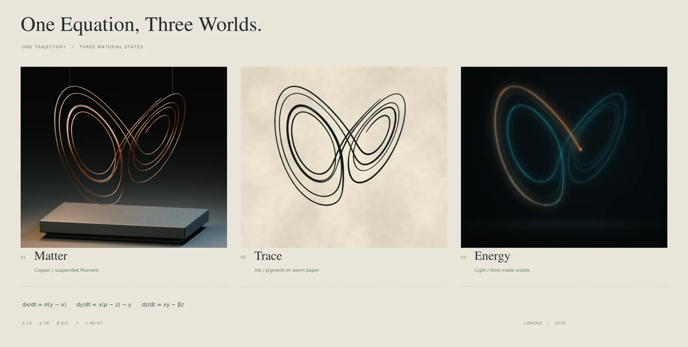
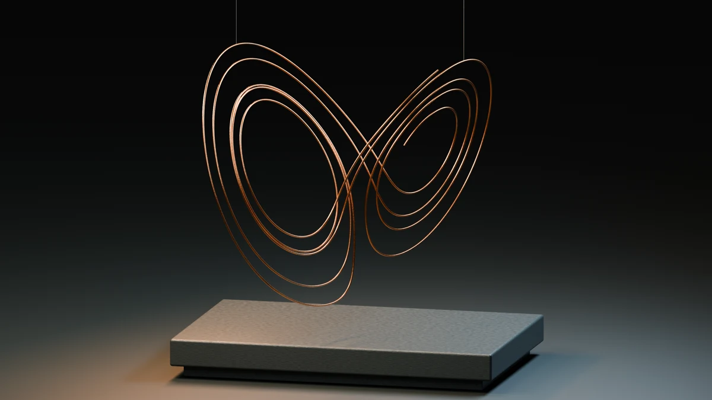
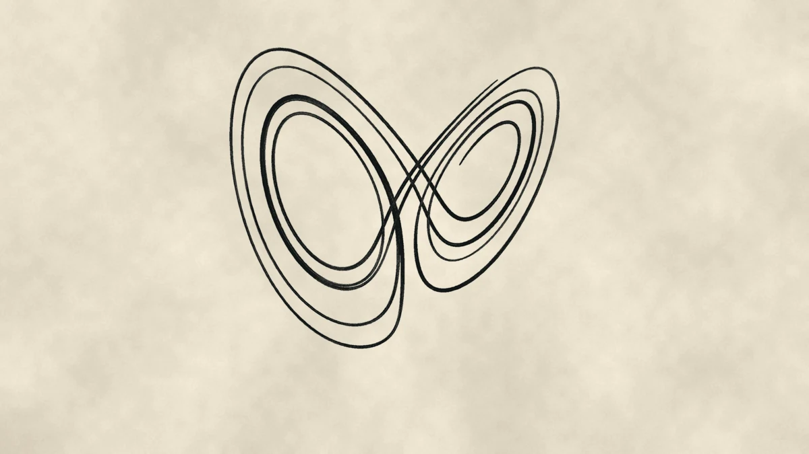
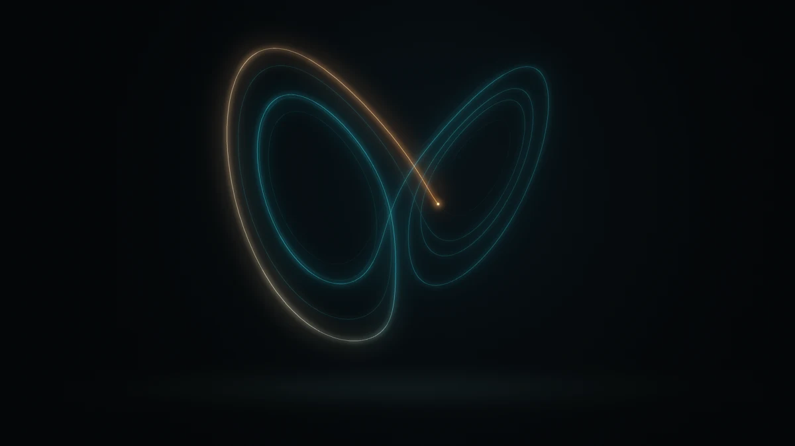

# One Equation, Three Worlds — ChatGPT Work

One numerically integrated Lorenz trajectory interpreted as suspended copper,
ink on warm paper, and a moving amber/blue-green light. The matched composition
becomes a **28-second silent film** and a **4200 × 2120 triptych**.



This is the independent **ChatGPT Work** response to the same brief as
[`../three-worlds/`](../three-worlds/), which records Claude's run. Neither run
replaces the other.

| | |
| :-- | :-- |
| Run date | 26 September 2026 |
| Model | Exact model name and identifier unrecorded |
| Harness | ChatGPT Work, cloud session |
| Human turns | 2: initial brief, then repository import; no mid-artwork intervention |
| Brief | [Verbatim requests](brief.md) |
| Process | [Original agent log](process/PROGRESS.md), [import notes](process/IMPORT.md), [snapshots](process/snapshots/), [studies](process/studies/) |
| Source account | [Original delivery README](process/ORIGINAL-README.md), preserved as historical evidence |
| Release | `run-three-worlds-chatgpt` — pending publication after merge |

<p>
  
  
  
</p>

Native-resolution detail crops: [copper](preview/matter-detail.webp),
[ink](preview/trace-detail.webp), [light](preview/energy-detail.webp).

## Reproduce

Use Python 3.12, Blender 4.0.2 (or a compatible Blender build), and FFmpeg with
libx264/ffprobe. The original environment and pinned Python libraries are in
[`data/environment.json`](data/environment.json) and `requirements.txt`.

From this directory:

```bash
python3.12 -m venv .venv
. .venv/bin/activate
pip install -r requirements.txt
python src/build.py
python src/verify.py
```

On macOS, add Blender's executable directory to `PATH` if needed:

```bash
export PATH="/Applications/Blender.app/Contents/MacOS:$PATH"
```

All generated media, scene files, projection exports, and frame caches are
written beneath ignored `output/`. The eight release assets are at its root.
The build keeps the committed canonical trajectory intact, copies its inputs
into `output/data/`, and runs copper → ink → light still → triptych → light
frames → film. It writes and verifies `SHA256SUMS` for every declared asset.

`--skip-matter` reuses an existing `output/Matter.png`. `--resimulate` repeats
the integration and selection in `output/data/`; it does not replace committed
historical data. Preserve the supplied dataset when exact geometry matters:
chaotic trajectories amplify tiny numerical differences across environments.
The light-frame cache validates completed PNGs and writes replacements
atomically. Remove only that cache when deliberately changing its renderer or
timing; source changes are not automatically detected.

Individual renderer scripts also run directly, for example
`python src/paint.py` or `blender -b -t 8 --python src/build_scene.py -- --study`.
The original study contact-sheet script requires its input study renders under
`output/studies/`; those are separate from the default final-output build.

## Mathematics and timing

```
dx/dt = 10(y − x)
dy/dt = x(28 − z) − y
dz/dt = xy − (8/3)z
initial condition = (1, 1, 1)
```

DOP853 integrates t=0–60 with rtol=1e−11, atol=1e−13, and a maximum internal
step of 0.01. t<20 is discarded from artistic selection. The chosen contiguous
interval is **t=40–47**, sampled at Δt=0.002: **3,501 positions**. CSV and NPZ
exports represent the same canonical trajectory; NPZ preserves full precision.

All three interpretations use the same geometry and camera projection. The
world transform is `(x/10, y/10, (z−6.26469892)/10+1)`. Camera position is
`(6,−24,7.3)`, target `(0,0,2.45)`, and orthographic scale 10.3. Brush pressure
changes width and density without moving the stroke's centerline.

The film holds copper, dissolves to ink at 4.7–6.7 s, then dissolves to light at
9.6–11.6 s. From 11.6–22.4 s, model time is
`40 + (7/10.8) × (film_seconds − 11.6)`. This constant slowdown preserves
simulation order. An endpoint hold and decay lead to an **editorial triptych**
at 23.4–24.7 s, held until 28 s. The light still in that montage uses t=46.5.
The trajectory is open: endpoint separation is about 13.12 Lorenz units. No
closing connector or physically seamless loop is claimed.

## Process notes and limitations

- **Matter** was rendered in Blender 4.0.2, CPU Cycles, 256 samples. Procedural
  copper/patina and stone, area-light reflections, a dark plinth, and separate
  suspension cables give the installation physical context. The original
  Blender build lacked OpenImageDenoiser; denoising remains disabled.
- **Trace** models pressure, bristle channels, pigment density, edge deposition,
  capillary blur, and fibrous paper procedurally in NumPy/SciPy/Pillow. It is an
  artistic ink model, not a fluid simulation.
- **Energy** is a depth-aware emissive Python composite with floating-point
  bloom, exposure roll-off, supersampling, and fixed dithering. It is not a
  path-traced volume or a particle cloud.
- The original environment exposed nine logical CPUs and about 10 GB RAM, with
  no GPU. The three clean stills are 3200 × 1800. Light frames render at
  2880 × 1620 then downsample to 1080p; the light still renders at 4800 × 2700.
- No image/video-generation models, downloaded artwork, meshes, or texture
  images were used. Font binaries are included with applicable copyright and
  license texts in `assets/fonts/`; their third-party licenses remain separate
  from the repository's MIT license. Unrelated Debian packaging/AppStream
  notices were omitted from the font-specific extracts.
- The historical progress log is a concise self-report, not a timestamped
  transcript. Wall-clock time and exact model identity are unrecorded. The
  curator's verdict is intentionally empty.
- One archived intermediate (`03-ink-2.png`) was truncated and could not be
  decoded during import. It was omitted from committed previews. The surviving
  ink contact sheet still records the three variants; the original archive was
  preserved unchanged. Finished assets decoded successfully.

## Release and provenance

This PR imports the original artifacts; it does not claim a new full render.
Committed previews are downsized from those originals. Full media and the
`.blend` stay in ignored `output/`, with their original hashes recorded in
[`process/ORIGINAL-SHA256SUMS`](process/ORIGINAL-SHA256SUMS). The original source
archive is preserved separately from adapted source; its checksum is recorded
in the import notes.

After merge, dispatch the existing **Run assets** workflow with input
`three-worlds-chatgpt`. Its run-local `src/build_release.sh` installs Blender and
FFmpeg only when missing on a GitHub Actions runner, then runs the pinned Python
pipeline. The manifest allows 110 minutes within the workflow's 120-minute job
limit. The hosted build has not yet been measured; its CPU speed and package
versions may affect duration and pixels. This workflow publishes a **rebuild**
with its own checksums and commit provenance, not a claim of byte-identical
original rendering.

If that build exceeds the runner limits, publish the preserved original eight
assets and their `SHA256SUMS` manually to `run-three-worlds-chatgpt`, clearly
labeling them as original outputs from 2026-09-26. Do not remove recovery copies
until downloaded assets pass `python3 scripts/fetch_assets.py three-worlds-chatgpt`.
No release is published by this import PR itself.
