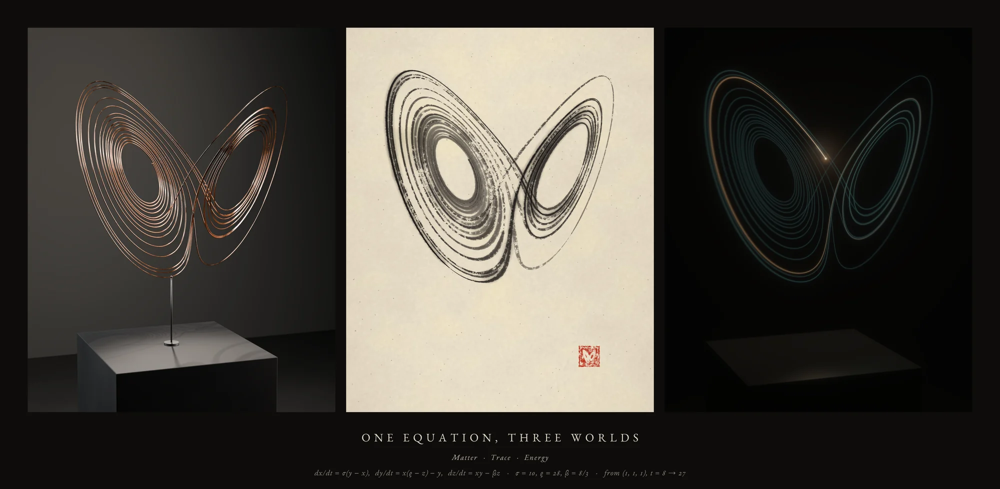
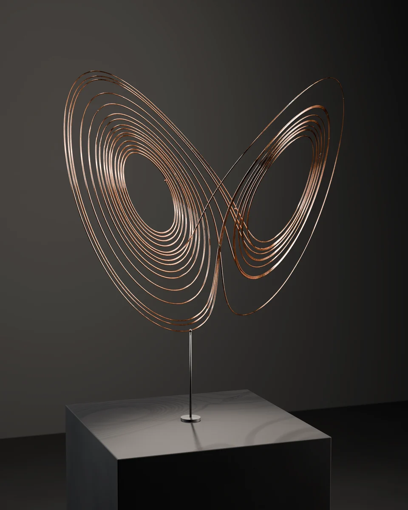
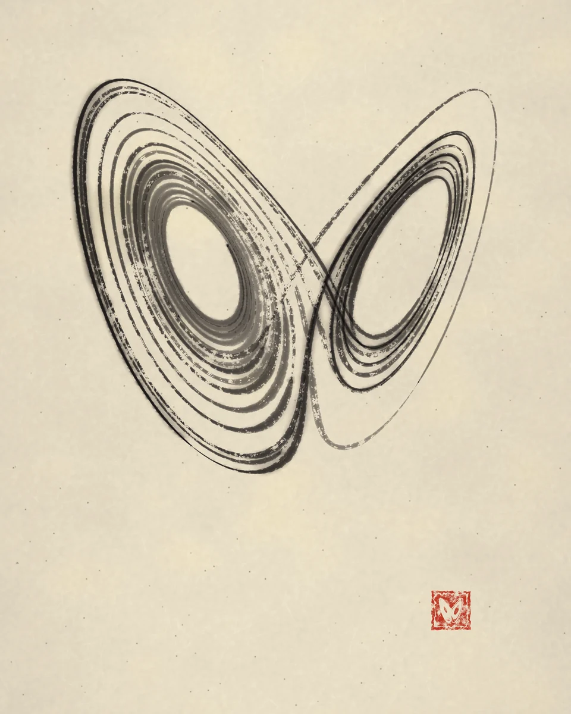
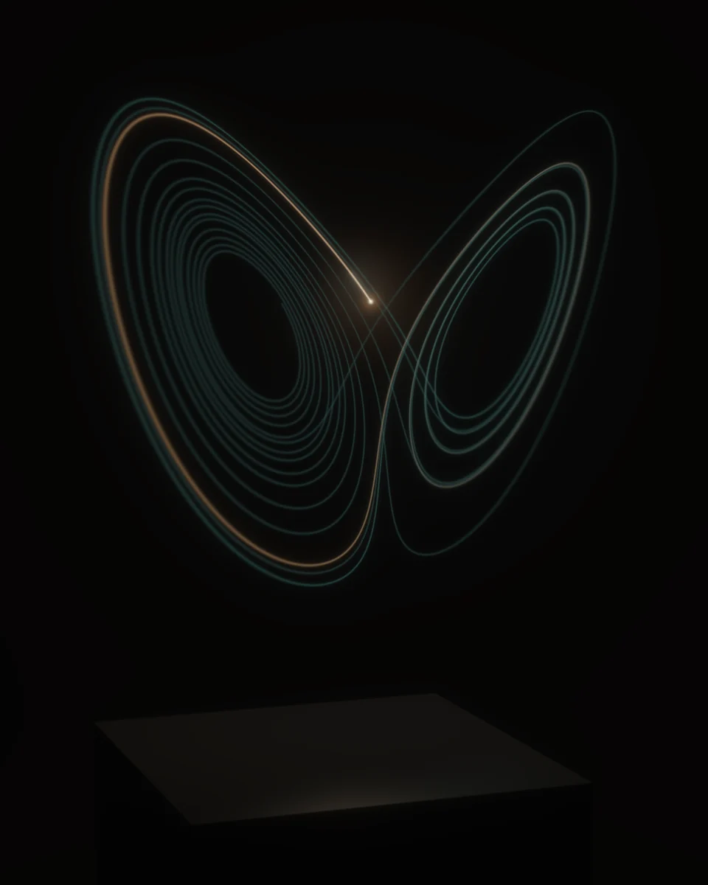
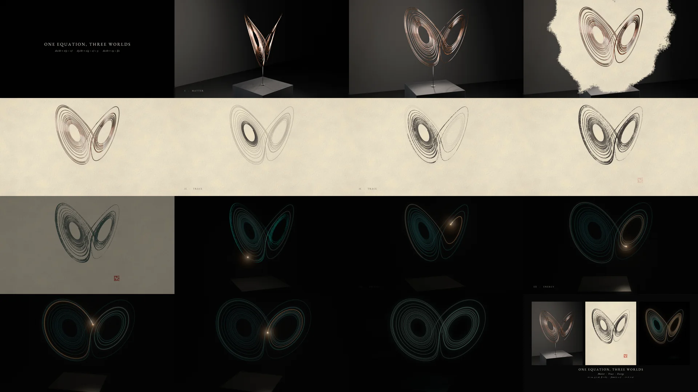

# One Equation, Three Worlds

One numerically integrated Lorenz trajectory, interpreted three times: as a
copper filament sculpture photographed in a gallery (**Matter**), as brush and
carbon ink on handmade paper (**Trace**), and as a travelling light in a dark,
hazy room (**Energy**). A 30-second film carries the same curve from metal to
ink to light at one matched camera, and ends where the computation stops being
trustworthy.



| | |
| :--- | :--- |
| **Model** | Claude Opus 5.5 (Claude Code, cloud session) |
| **Brief** | [`brief.md`](brief.md) — one prompt for the artwork; a second message later changed only the repository layout |
| **Wall clock** | about 3 h 10 min (13:01–16:10 UTC), including all iteration |
| **Full-size outputs** | [release `run-three-worlds`](https://github.com/davisbuilds/oneshots/releases/tag/run-three-worlds): the film (master and web copy), three 2400 × 3000 stills, the triptych, the Blender scene, the trajectory CSV |
| **Process** | [`process/PROGRESS.md`](process/PROGRESS.md), [snapshots](process/snapshots/), [studies](process/studies/) |

| | World | Medium | What it holds |
| :-- | :-- | :-- | :-- |
| I | **Matter** | a copper filament over a basalt plinth (Blender / Cycles) | all of the segment at once, frozen |
| II | **Trace** | brush and carbon ink on handmade paper (procedural painter) | the segment accumulating, in the order it happened |
| III | **Energy** | a travelling light in a dark room (splat renderer) | only the present, and a fading memory of the past |

<p>
  
  
  
</p>

Full-resolution details: [copper wires](preview/detail-copper-wires.webp) ·
[the filament's shadow on the plinth](preview/detail-copper-plinth-shadow.webp) ·
[dry-brush ink](preview/detail-ink-drybrush.webp) · [the light's head](preview/detail-light-head.webp).
The film, frame by frame across its 30 s:



## Reproduce

From this directory, with Python 3.11 (the `bpy` wheel requires it):

```bash
pip install -r requirements.txt
sudo apt-get install ffmpeg fonts-ebgaramond
python3 src/build.py      # every output, in order, into output/ (resumable)
python3 src/verify.py     # dataset reproduced array-for-array; asset sizes and frame counts
```

`build.py` runs, in order: `lorenz.py` (the dataset), `render_copper_frames.py`
(150 Cycles frames), `stills.py copper` (also saves the `.blend`), `stills.py ink`,
`stills.py light`, `film.py --encode`, `stills.py triptych`, then writes
`output/SHA256SUMS`. Each step skips outputs that already exist. It takes about
four hours on 4 CPU cores, most of it the Matter frames.
`src/copper_scene.py` also runs inside a desktop Blender:
`blender -b -P src/copper_scene.py -- --save-blend scene.blend --no-render`.

## How it is made

### The mathematics

```
dx/dt = σ (y − x)        σ = 10
dy/dt = x (ρ − z) − y    ρ = 28
dz/dt = x y − β z        β = 8/3        x(0) = (1, 1, 1)
```

* **Solver.** `scipy.integrate.solve_ivp`, method **DOP853** (explicit Runge–Kutta 8(5,3), adaptive step),
  `rtol = atol = 1e-12`, integrated on **t ∈ [0, 120]**. The dense-output interpolant is sampled on a
  uniform grid **Δt = 0.001**.
* **Transient discarded:** t ∈ [0, 8). From (1, 1, 1) the orbit reaches the left wing within t < 1 and then
  spirals slowly outward around the fixed point C₋ = (−√72, −√72, 27) until t ≈ 13, when chaotic
  wing-switching begins.
* **Selected segment: t ∈ [8, 27]** — 19 time units, 19 001 samples, 26 loops (maxima of z), 9 wing switches.
  It opens in the eye of the left spiral, unwinds outward (order), then breaks into switching (chaos).
* **Why it stops at 27.** Chaos amplifies error exponentially. Re-integrating with DOP853 at 1e-13 shows the
  1e-12 solution deviates by more than 10⁻⁶ after t ≈ 20.6 and by more than 10⁻³ after **t ≈ 27.4**
  (LSODA at 1e-10 departs by a whole unit at t ≈ 27.4). So t = 27 is roughly the horizon to which this
  orbit is *the* orbit from (1, 1, 1) and not merely a shadow of it. The film's ending is placed there.
* **Canonical dataset:** [`data/lorenz_canonical.npz`](data/) with all solver metadata in
  `data/lorenz_canonical.json`; arrays `t, xyz, vel, speed`. The same data as CSV is a release asset.
  `python3 src/lorenz.py --select 8 27` regenerates it identically (`src/verify.py` checks this).

Every world is derived from that file alone. Each renderer maps it into the same physical frame
(`src/common.py: to_world` — a rigid rotation of −28° about the vertical axis and a uniform scale of 15.8 mm per
unit, so the attractor stands 0.56 m tall, 0.20 m above a 0.92 m plinth) and views it through the same pinhole
camera **K** (`data/camera_canonical.json`: azimuth −20°, elevation 6°, 50 mm, f/8). No segment is added,
smoothed away or reordered.

### Artistic choices

**One rule crosses all three media: slow passages weigh more.** The trajectory's own speed |ẋ| (30 → 293 units/s)
sets the copper wire's gauge (±18 %), the brush pressure, and, through time remapping, how long the light lingers.

**I · Matter**
* 27.2 m of 2.7 mm copper filament, swept as a tube mesh (parallel-transport frames, 12 357 rings) directly from
  the canonical samples; beads mark the first and last instant; one blackened steel rod rises from the plinth
  to the lowest point of the orbit.
* Procedural copper (polished → tarnished ramp, satin roughness variation, faint draw marks, sparse verdigris),
  honed basalt with mineral specks, dark concrete and wall. No textures or downloaded assets.
* Lighting: a crisp near-overhead spot makes the filament draw its **own x–y shadow on the plinth** (a third
  projection of the curve); tall strip softboxes seen only in reflection sculpt the metal; a rim and a wall wash
  separate it from the dark.
* The film orbits from azimuth −62° (wings folded edge-on into a "V") to K, where the butterfly opens.

**II · Trace**
* Paper: band-limited noise tooth, fibre clumping, 2 600 drawn fibres per 2 MP, sparse inclusions,
  raking-light emboss, warm unbleached tint.
* Brush: the projected curve is split into **16 strokes** at (randomly offset) loop bottoms. Each stroke is a
  64-bristle brush with clumps and gaps; its ink load decays along the stroke, and deposition is gated by
  `bristle density + paper height + load`, so a loaded brush lays solid ink and a spent one breaks into
  **dry-brush** streaks on the paper's peaks.
* Width = pressure (speed, as above) × nearness to the viewer × a slanted round-brush thick/thin by direction,
  capped by **clearance** (the on-page distance to the nearest other passage), so strokes are bold where there
  is room and fine inside the dense spiral.
* Tone: the quiet unfolding spiral (t < 12) is laid in diluted ink; chaos arrives in black; far loops are
  diluted (ink-painting aerial perspective).
* Water as a post-process: restrained fibre-guided **bleeding**, pigment carried to drying rims (**edge
  darkening**), **pooling** at touch-downs and overlaps, a pale **wash** where passages gather (the wings are
  nearly 2-D sheets), granulation in the tooth. A vermilion seal whose carving is the trajectory itself.

**III · Energy**
* A head moves along the trajectory in strict temporal order (see time remapping below). The trail is the
  travelled path; each point fades with the **film time** elapsed since the head passed it (bright 0.05 s
  flash → 0.55 s amber → 3.2 s blue-green memory), like a phosphor.
* Energy-conserving Gaussian splats at ≤ 0.5 px spacing; depth of field from the same lens and f-stop;
  inverse-square falloff with distance; a 180° shutter motion-blurs the head.
* The head and recent trail illuminate the plinth (Lambert + honed sheen, inverse square) and scatter in a thin
  haze (closed-form single-scatter integral per light sample, occluded by the plinth).
* The final panel is a long exposure coloured by *when* the head passed: blue-green at t = 8 → amber at t = 27.

### The film (30 s)

| time | |
| :-- | :-- |
| 0–2.5 s | title and the three equations |
| 2.2–8.9 s | **Matter** — orbit from edge-on to K |
| 8.9–10.6 s | matched dissolve at K: paper spreads outward from the filament like a wash; the copper leaves a pale guide line |
| 10.6–17.4 s | **Trace** — the brush paints the trajectory in temporal order over the guide; the seal is pressed |
| 17.0–18.7 s | matched hand-over at K: the room light goes down, the ink strokes answer in faint blue-green and become the light's afterglow; the head ignites at t = 18.5 |
| 18.6–25.4 s | **Energy** — the head travels t = 18.5 → 27 while the camera drifts 38° around to reveal depth |
| 25.4–26.3 s | the head reaches t = 27 and goes out: the prediction horizon, not a loop |
| 25.9–30 s | the three worlds together; fade out |

**Time remapping (monotonic).**
*Trace:* strokes are painted in order; stroke *i* takes time ∝ (length)^0.8 with an eased hand
(`0.65x + 0.35·(1−cos πx)/2`), with 0.07 s brush lifts between strokes; 19 time units in 5.3 s
(`src/ink.py: paint_schedule`).
*Energy:* the act joins the light mid-performance. Travelling all 19 units in under 7 s would mean ~5 loops per
second (the head would strobe at 24 fps), so the head is seen travelling t = 18.5 → 27 in strict order:
τ(s) = 18.5 + 8.5·G(u), u = (s − 18.6)/6.8, G the normalised integral of the speed profile
`0.55 + 0.6·sin(πu)^0.7`, i.e. 0.74 to 1.48 time units per second, about 2 loops per second at most. The earlier
path t = 8 → 18.5 is present only as afterglow, treated as traversed in the ~2 s before the act (compressed 5×)
so that it glows blue-green exactly where the ink strokes glowed a moment before
(`src/light.py: traj_time, film_time_of`).

The trajectory is not periodic and the film never pretends it is: the only joins between worlds are editorial
dissolves at an identical camera, and the light ends where the computation's trustworthiness ends.

### Tools actually used (all executed in the run)

* Python 3.11, NumPy 2.4, SciPy 1.17, Numba 0.67, Pillow 12.3, Matplotlib 3.11 (studies).
* **Blender 5.0.1 as the `bpy` Python module** (PyPI wheel), **Cycles on CPU** (4 cores, no GPU), OpenImageDenoise.
  Eevee was unavailable (no OpenGL/EGL in the container).
* FFmpeg 6.1 (libx264). Typeface: EB Garamond (SIL OFL, Ubuntu package `fonts-ebgaramond`).
* No image- or video-generation models, no downloaded artwork, meshes or textures.

## Process notes and limitations

* **Release assets are uploaded by hand.** The full build is about four hours of CPU and needs `ffmpeg` and
  `fonts-ebgaramond` from apt, so it does not fit the **Run assets** workflow (120-minute job limit, pip-only
  install). The assets are the files the run itself produced, uploaded to `run-three-worlds` with the
  `SHA256SUMS` that `src/build.py` writes. `src/verify.py` still runs against any finished build.
* Render costs on 4 CPU cores: Matter film frames 24 samples/pixel + OIDN, 52–110 s each (150 frames);
  copper still 128 spp, 25 min; ink frames ~1.5 s; light frames 5–11 s. Mild denoiser residue is visible
  on the plinth top of film frames at full resolution.
* The basalt plinth reads slate-grey rather than black under the overhead key: its top is where the
  filament's shadow is drawn, so it was kept lit.
* The Energy act shows the head travelling only t = 18.5 → 27 (see time remapping); t = 8 → 18.5 appears as afterglow.
* Ink and light are custom renderers, not physical simulations: bleeding, pooling and granulation are
  image-space models driven by a water layer; the haze is single scattering from point samples.
* The light world's plinth reflection is physically placed and therefore subtle from this camera height.
* The Blender file contains the copper world only; the ink and light worlds are code.
* `process/PROGRESS.md` was kept without times during the run; its times are reconstructed from commit and
  file timestamps.
