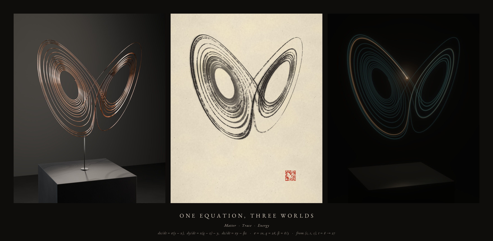

# One Equation, Three Worlds



One numerically integrated Lorenz trajectory, interpreted three times:

| | World | Medium | What it holds |
|---|---|---|---|
| I | **Matter** | a copper filament over a basalt plinth (Blender / Cycles) | all of the segment at once, frozen |
| II | **Trace** | brush and carbon ink on handmade paper (procedural painter) | the segment accumulating, in the order it happened |
| III | **Energy** | a travelling light in a dark, hazy room (spectral splat renderer) | only the present, and a fading memory of the past |

**Film:** [`out/one_equation_three_worlds.mp4`](out/one_equation_three_worlds.mp4) — 30 s, 1920×1080, 24 fps, H.264.
**Stills (2400×3000):** [`out/matter_copper.png`](out/matter_copper.png) · [`out/trace_ink.png`](out/trace_ink.png) · [`out/energy_light.png`](out/energy_light.png) · **Triptych:** [`out/triptych.jpg`](out/triptych.jpg)
**Editable Blender scene:** [`out/copper_sculpture.blend`](out/copper_sculpture.blend) · **Dataset:** [`data/`](data/) · **Studies:** [`studies/`](studies/)

Made with Claude Code in a single session.

---

## The mathematics

```
dx/dt = σ (y − x)        σ = 10
dy/dt = x (ρ − z) − y    ρ = 28
dz/dt = x y − β z        β = 8/3        x(0) = (1, 1, 1)
```

* **Solver.** `scipy.integrate.solve_ivp`, method **DOP853** (explicit Runge–Kutta 8(5,3), adaptive step),
  `rtol = atol = 1e-12`, integrated on **t ∈ [0, 120]**. The dense-output interpolant is sampled on a
  uniform grid **Δt = 0.001**.
* **Transient discarded:** t ∈ [0, 8). From (1, 1, 1) the orbit reaches the left wing within t < 1 and then
  spirals slowly outward around the fixed point C₋ = (−√72, −√72, 27) until t ≈ 13, when chaotic
  wing-switching begins.
* **Selected segment: t ∈ [8, 27]** — 19 time units, 19 001 samples, 26 loops (maxima of z), 9 wing switches.
  It opens in the eye of the left spiral, unwinds outward (order), then breaks into switching (chaos).
* **Why it stops at 27.** Chaos amplifies error exponentially. Re-integrating with DOP853 at 1e-13 shows the
  1e-12 solution deviates by more than 10⁻⁶ after t ≈ 20.6 and by more than 10⁻³ after **t ≈ 27.4**
  (LSODA at 1e-10 departs by a whole unit at t ≈ 27.4). So t = 27 is roughly the horizon to which this
  orbit is *the* orbit from (1, 1, 1) and not merely a shadow of it. The film's ending is placed there.
* **Canonical dataset:** `data/lorenz_canonical.{npz,csv,json}` — columns `t, x, y, z, dx/dt, dy/dt, dz/dt, speed`,
  plus all solver metadata. Regenerate bit-identically with `python3 src/lorenz.py --select 8 27`.

Every world is derived from that file alone. Each renderer maps it into the same physical frame
(`src/common.py: to_world` — a rigid rotation of −28° about the vertical axis and a uniform scale of 15.8 mm per
unit, so the attractor stands 0.56 m tall, 0.20 m above a 0.92 m plinth) and views it through the same pinhole
camera **K** (`data/camera_canonical.json`: azimuth −20°, elevation 6°, 50 mm, f/8). No segment is added,
smoothed away or reordered.

## Artistic choices

**One rule crosses all three media: slow passages weigh more.** The trajectory's own speed |ẋ| (30 → 293 units/s)
sets the copper wire's gauge (±18 %), the brush pressure, and — through time remapping — how long the light lingers.

### I · Matter
* 27.2 m of 2.7 mm copper filament, swept as a tube mesh (parallel-transport frames, 12 357 rings) directly from
  the canonical samples; beads mark the first and last instant; one blackened steel rod rises from the plinth
  to the lowest point of the orbit.
* Procedural copper (polished → tarnished ramp, satin roughness variation, faint draw marks, sparse verdigris),
  honed basalt with mineral specks, dark concrete and wall. No textures or downloaded assets.
* Lighting: a crisp near-overhead spot makes the filament draw its **own x–y shadow on the plinth** (a third
  projection of the curve); tall strip softboxes seen only in reflection sculpt the metal; a rim and a wall wash
  separate it from the dark.
* The film orbits from azimuth −62° (wings folded edge-on into a "V") to K, where the butterfly opens.

### II · Trace
* Paper: band-limited noise tooth, fibre clumping ("cloudiness"), 2 600 drawn fibres per 2 MP, sparse
  inclusions, raking-light emboss, warm unbleached tint.
* Brush: the projected curve is split into **16 strokes** at (randomly offset) loop bottoms. Each stroke is a
  64-bristle brush with clumps and gaps; its ink load decays along the stroke, and deposition is gated by
  `bristle density + paper height + load`, so a loaded brush lays solid ink and a spent one breaks into
  **dry-brush** streaks on the paper's peaks.
* Width = pressure (speed, as above) × nearness to the viewer × a slanted round-brush thick/thin by direction,
  capped by **clearance** — the on-page distance to the nearest other passage — so strokes are bold where there
  is room and fine inside the dense spiral (legibility over tangle).
* Tone: the quiet unfolding spiral (t < 12) is laid in diluted ink; chaos arrives in black; far loops are
  diluted (ink-painting aerial perspective).
* Water as a post-process: restrained fibre-guided **bleeding**, pigment carried to drying rims (**edge
  darkening**), **pooling** at touch-downs and overlaps, a pale **wash** where passages gather (the wings are
  nearly 2-D sheets), granulation in the tooth. A vermilion seal whose carving is the trajectory itself.

### III · Energy
* A head moves along the trajectory in strict temporal order. The trail is the travelled path; each point
  fades with the **film time** elapsed since the head passed it (bright 0.05 s flash → 0.55 s amber →
  3.2 s blue-green memory), like a phosphor.
* Energy-conserving Gaussian splats at ≤ 0.5 px spacing; depth of field from the same lens/f-stop; inverse-square
  falloff with distance; a 180° shutter motion-blurs the head.
* The head and recent trail illuminate the plinth (Lambert + honed sheen, inverse square) and scatter in a thin
  haze (closed-form single-scatter integral per light sample, occluded by the plinth).
* The final panel is a long exposure coloured by *when* the head passed: blue-green at t = 8 → amber at t = 27.

## The film (30 s)

| time | |
|---|---|
| 0–2.5 s | title and the three equations |
| 2.2–8.9 s | **Matter** — orbit from edge-on to K |
| 8.9–10.6 s | matched dissolve at K: paper spreads outward from the filament like a wash; the copper leaves a pale guide line |
| 10.6–17.4 s | **Trace** — the brush paints the trajectory in temporal order over the guide; the seal is pressed |
| 17.0–18.7 s | matched hand-over at K: the room light goes down, the ink strokes answer in faint blue-green, the head ignites at t = 8 |
| 18.6–25.4 s | **Energy** — the head travels t = 8 → 27 while the camera drifts 38° around to reveal depth |
| 25.4–26.3 s | the head reaches t = 27 and goes out: the prediction horizon, not a loop |
| 25.9–30 s | the three worlds together; fade out |

**Time remapping (documented, monotonic).**
*Trace:* strokes are painted in order; stroke *i* takes time ∝ (length)^0.8 with an eased hand
(`0.65x + 0.35·(1−cos πx)/2`), with 0.07 s brush lifts between strokes; 19 time units in 5.3 s
(`src/ink.py: paint_schedule`).
*Energy:* trajectory time τ(s) = 8 + 19·G(u), u = (s − 18.6)/6.8, where G is the normalised integral of the speed
profile `0.30 + sin(πu)^0.7 + 0.25u` — a slow ignition in the spiral eye, brisk through the chaos, easing toward
t = 27 (`src/light.py: traj_time`). Mean rate 2.8 time units per second.

The trajectory is not periodic and the film never pretends it is: the only joins between worlds are editorial
dissolves at an identical camera, and the light ends where the computation's trustworthiness ends.

## Tools actually used (all executed in this session)

* Python 3.11, NumPy 2.4, SciPy 1.17, Numba 0.67, Pillow 12.3, Matplotlib 3.11 (studies).
* **Blender 5.0.1 as the `bpy` Python module** (PyPI wheel), **Cycles on CPU** (4 cores, no GPU), OpenImageDenoise.
  Eevee was unavailable (no OpenGL/EGL in the container).
* FFmpeg 6.1 (libx264). Typeface: EB Garamond (SIL OFL, Ubuntu package `fonts-ebgaramond`).
* No image- or video-generation models, no downloaded artwork, meshes or textures.

## Reproduce

```bash
pip install numpy scipy numba pillow matplotlib bpy==5.0.1        # bpy wheel needs Python 3.11
sudo apt-get install ffmpeg fonts-ebgaramond
python3 src/lorenz.py --select 8 27             # canonical dataset (bit-identical)
python3 src/render_copper_frames.py             # Matter act, 150 Cycles frames (resumable)
python3 src/film.py --encode                    # all other frames + composite + MP4 (resumable)
python3 src/stills.py ink; python3 src/stills.py light
python3 src/stills.py copper --samples 128      # also saves out/copper_sculpture.blend
python3 src/stills.py triptych
```
`src/copper_scene.py` also runs inside a desktop Blender: `blender -b -P src/copper_scene.py -- --save-blend scene.blend --no-render`.
`LOG.md` records the process; every render step skips outputs that already exist.

## Limitations

* The Matter film frames use 24 samples/pixel + OIDN to fit a CPU budget (~55 s/frame); the still uses more.
  Mild denoiser residue is visible on the plinth top at full resolution.
* Ink and light are custom renderers, not physical simulations: bleeding, pooling and granulation are
  image-space models driven by a water layer; the haze is single scattering from point samples.
* The light world's plinth reflection is physically placed and therefore subtle from this camera height.
* The Blender file contains the copper world only; the ink and light worlds are code.
