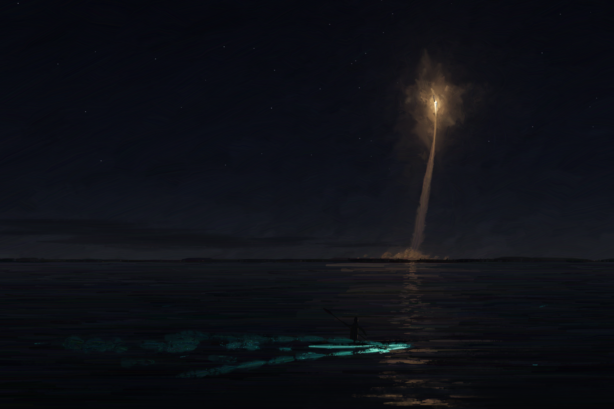

# Two Kinds of Fire

An original nocturne painted entirely by Python code: a small kayak on the
Indian River Lagoon at night, stirring blue-green bioluminescence, while far
across the water a rocket climbs above Cape Canaveral in a warm white-gold
plume. It is an imagined Space Coast scene, not a specific launch.



**Model:** Claude Opus 5.5 (Claude Code, cloud session)

## Reproduce (one command)

```bash
pip install -r two-kinds-of-fire/requirements.txt
python3 two-kinds-of-fire/src/paint.py
```

This writes, into `two-kinds-of-fire/output/`:

| File | What it is |
| :--- | :--- |
| `two_kinds_of_fire.png` | the final painting, 3000 × 2000 |
| `stages/NN_*.jpg` | the canvas at the end of each of the 14 painting stages (1500 px) |
| `stroke_log.jsonl.gz` | every draw operation, in order (4,511 strokes) |
| `two_kinds_of_fire_making_of.mp4` | 27 s film of the painting being made (1920 × 1280, H.264) |

Runtime is about 12 minutes on 4 CPU cores (≈6 min painting, the rest is
capturing and lighting 809 film frames). `--no-video` skips the film;
`--studies` re-paints the small composition studies A–D (or e.g.
`--studies DEFG`).

Replay from the log onto a blank canvas (any size; `--upto N` stops after N
strokes):

```bash
python3 two-kinds-of-fire/src/replay.py two-kinds-of-fire/output/stroke_log.jsonl.gz --out replay.png
```

## How it is made

No image model, no downloaded or embedded imagery, no photo filter. NumPy does
the arithmetic, Pillow only resamples and writes files, and FFmpeg only encodes
the film. Everything visible comes from `Canvas.stroke` in `src/brush.py`:

- **Brush.** A stroke is a smoothed centre-line swept by a row of bristles.
  Each bristle has its own paint load, run-out length and colour offset, so
  strokes streak and carry broken colour. A second colour can be loaded onto a
  subset of the bristles.
- **Paint and canvas.** The canvas has an irregular linen-and-gesso tooth.
  Loaded paint covers it. As the brush runs dry, paint catches only the high
  points and breaks along the direction of travel (dry brush and scumble)
  instead of turning transparent.
- **Wet paint.** A brush can drag paint already on the canvas along with it
  (smear). A glaze mode tints what lies beneath.
- **Impasto.** Loaded strokes can deposit height. At the end, a raking light
  from the upper left is computed from that height plus the canvas tooth. Only
  the flame core and the brightest bioluminescent flecks are laid on thick.

`src/scene.py` is the painting program. It works like a painter: warm umber
ground; big sky and water masses (criss-crossed and blended wet-into-wet);
horizon haze and a low cloud bank; the launch light scumbled up in veils; the
exhaust column, the flame and the tiny rocket; the far shore (lost against the
dark on the left, found against the ground cloud); the broken reflected path;
the water surface; a dim blue-green underlayer; the kayak and paddler; the
bioluminescent wake, paddle swirls and flecks; then stars and the last accents.
Colours come from a restrained palette: indigo night, one warm ramp and one
blue-green ramp.

The composition was chosen from seven small studies (`studies/`; those images
were painted by earlier versions of the engine, so re-running `--studies`
now gives slightly different pictures). The kayak's
bow enters the gold reflected path while its wake trails back through
blue-green water, so the small human sits between the two lights.

## Parameters

- Seed: `20260925` (all randomness derives from it; every stroke also records
  its own seed).
- Canvas: 3000 × 2000 (aspect 1.5). The final composition is `scene.FINAL`:
  horizon at 0.64 H, launch pad at x 0.665 W, rocket 0.39 H above the
  horizon, kayak at (0.585 W, 0.845 H), length 0.165 W, heading right,
  wake 0.40 W.
- Film: 30 fps, 23 s build plus 0.8 s blank-canvas hold and 3.2 s final hold.
  Frames come from the live canvas during the full-resolution render. Screen
  time is budgeted per stage (`film.STAGE_TIME`) and spread within a stage by
  stroke effort. Each frame is the downsampled canvas, lit, with a small
  caption naming the stage and the stroke count.

## Dependencies

| Package | Version used | Role |
| :--- | :--- | :--- |
| Python | 3.11.15 | |
| NumPy | 2.4.6 | all brush, noise and lighting maths |
| Pillow | 12.3.0 | resampling, PNG/JPEG I/O, caption text in the film |
| imageio-ffmpeg | 0.6.0 (FFmpeg 7.0.2) | H.264 encoding of the film only |

## Process notes and limitations

See [`PROGRESS.md`](PROGRESS.md) for the full, timestamped log, and `renders/`
for the numbered intermediate renders and crops it refers to.

- The raking-light impasto is a 2.5-D approximation. It is height-map
  shading, not a physical paint simulation, and the paint does not dry or mix
  pigment-wise. Colour mixing is linear RGB blending.
- The whole scene is painted in one deterministic pass. A human painter would
  wipe out and repaint; here the "wiping out" happened between iterations of
  the program, as recorded in the log.
- The film shows the actual accumulating canvas, but it samples it. Of the
  4,511 strokes, 690 build frames are captured, so late small touches appear
  several per frame.
- The kayak is small (about 500 px long) and deliberately a silhouette.
  Viewed at thumbnail size, the figure reads mainly through its paddle and
  glowing waterline.
